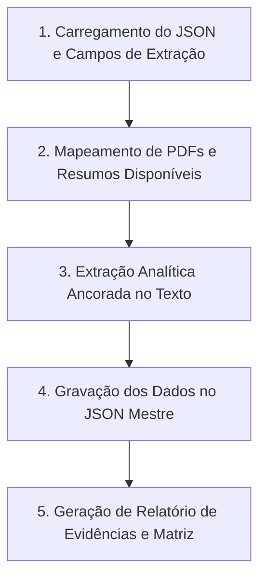

# Skill: Extração Estruturada e Analítica de Dados (Triagem 2 / Extração)

## Visão Geral
Esta skill orienta qualquer modelo atuando no Antigravity a realizar a **Extração Estruturada de Dados (Triagem 2 / Extração)** nos estudos marcados como `"Incluído"`. A extração é realizada com a **mesma precisão, clareza, especificidade e alinhamento estrito ao texto** da API do Gemini no aplicativo.

---

## 🛑 DIRETRIZES INEGOCIÁVEIS DE QUALIDADE E EXTRAÇÃO (ZERO ALUCINAÇÃO)

1. **FIDELIDADE ABSOLUTA E ANCORAGEM TEXTUAL**:
   - Para cada campo de extração solicitado (definido em `campos_extracao`), extraia e sintetize **UNICAMENTE as informações explicitamente presentes no texto** (PDF completo se disponível, ou resumo/metadados).
   - Se um determinado campo de extração **NÃO for mencionado no texto**, responda obrigatoriamente: `"Não informado no texto"`.
   - **PROIBIDO ALUCINAR OU PRESUMIR**: Nunca invente técnicas econométricas (ex: DID, RDD, PSM), programas sociais ou amostras se não constarem claramente do documento.

2. **RESPOSTAS ULTRA-ESPECÍFICAS E DIRETAS**:
   - Evite generalizações vagas como *"Usa métodos quantitativos"* ou *"Estuda políticas públicas"*.
   - **Correto / Específico**: `"Utiliza Regressão em Descontinuidade (RDD) com dados de 5.570 municípios brasileiros (2010-2020) para avaliar o efeito do Programa Bolsa Família sobre a frequência escolar."`
   - **Incorreto / Genérico**: `"Aborda o impacto de programas sociais com metodologia empírica."`

3. **ESTRUTURA DE DADOS E REGISTRO DE RESPOSTAS**:
   - Registre as extrações em `paper['Extracao']['respostas_questoes']` utilizando exatamente as chaves de cada campo solicitado em `campos_extracao`.
   - Preencha `status_extracao` como `"Concluída"` quando os dados principais forem extraídos com sucesso, ou `"Pendente"` se faltarem dados essenciais.
   - Preencha `observacoes` com limitações metodológicas, potenciais viéses e pontos críticos declarados pelos próprios autores.

---

## Protocolo de Execução em 5 Passos



---

### Passo 1: Carregamento do JSON Mestre e Campos de Extração

1. Ler a estrutura do arquivo `causalidade/revisao_sistematica2.json` (ou equivalente).
2. Identificar a lista de estudos com `"Decisao": "Incluído"`.
3. Obter os **Campos de Extração** da sessão ou do protocolo:
   - **Identificação Bibliográfica** (Autores, Ano, Título, Tipo de Documento)
   - **Conceito Causal Principal** (Inferência Causal, Descoberta Causal, Causalidade Geral)
   - **Contexto de Aplicação** (Políticas Públicas / Desenvolvimento Regional / Intersecção)
   - **Técnicas e Métodos Específicos Empregados** (ex: *Diferenças em Diferenças (DID)*, *Regressão em Descontinuidade (RDD)*, *Propensity Score Matching (PSM)*, *Controle Sintético*, *Variáveis Instrumentais (IV)*, *Process Tracing*, *QCA*, *Granger*, *DAGs*)
   - **Perspectiva Histórica ou Temporal** abordada sobre o uso da causalidade
   - **Principais Achados, Lacunas Metodológicas e Limitações**

---

### Passo 2: Mapeamento dos Textos e PDFs Disponíveis

Para cada estudo com `"Decisao": "Incluído"`:
1. Verificar se o estudo possui PDF local baixado (`status_pdf == 'Baixado'` e `caminho_pdf` válido).
2. Se o PDF estiver presente, utilizar o texto do PDF (`texto_extraido`) como fonte primária enriquecida.
3. Se o PDF não estiver baixado ou o arquivo for apenas escaneado/imagem, utilizar o **Título**, **Resumo Completo**, **Autores** e **Ano** do cadastro como fonte primária.

---

### Passo 3: Extração Analítica pelo Modelo Antigravity

Para cada estudo incluído, o modelo analisa o texto disponível e responde a cada um dos campos de extração:

#### Diretrizes para Preenchimento dos Campos:

- **Conceito Causal Principal**:
  - Classificar com base estrita no texto: `Inferência Causal Empírica`, `Descoberta Causal Algorítmica`, `Causalidade Teórica/Conceitual` ou `Avaliação Causal de Impacto`.
- **Técnicas e Métodos Específicos**:
  - Especificar a técnica quantitativa/qualitativa exata declarada (ex: *"Diferenças em Diferenças com Efeitos Fixos"*, *"Regressão em Descontinuidade RDD RDM"*, *"Matching por Escore de Propensão PSM"*, *"Process Tracing Qualitativo"*). Se o texto não citar a técnica específica, responda `"Não informado no texto"`.
- **Contexto de Aplicação**:
  - Identificar a política pública específica (ex: *Programa Bolsa Família*, *Fundeb*, *Pacto pela Vida*, *Crédito Rural*, *SUS*, *Incentivos Fiscais*) e o recorte regional citados (ex: *Municípios do Nordeste*, *Brasil*, *Estado do Ceará*).
- **Principais Achados e Limitações**:
  - Resumir o efeito causal observado (positivo, negativo, nulo) e a principal limitação identificada pelos autores (ex: *viés de seleção*, *tendências paralelas não testadas*, *attrition*).
- **Status da Extração**:
  - Definir como `"Concluída"` quando os campos forem satisfatoriamente preenchidos, ou `"Pendente"` se as informações forem insuficientes.

---

### Passo 4: Gravação dos Dados Estruturados no JSON

1. Salvar os resultados dentro de cada trabalho em `paper['Extracao']`:
   ```json
   "Extracao": {
       "status_extracao": "Concluída",
       "respostas_questoes": {
           "Identificação bibliográfica": "...",
           "Conceito causal principal abordado": "...",
           "Contexto de aplicação": "...",
           "Técnicas e métodos específicos empregados": "...",
           "Perspectiva histórica ou temporal abordada": "...",
           "Principais achados, lacunas metodológicas e limitações": "..."
       },
       "observacoes": "Síntese das contribuições e viés metodológico..."
   }
   ```
2. **Higienização de Strings**: Aplicar `.encode('utf-8', 'ignore').decode('utf-8')` no texto extraído para garantir gravações 100% válidas.

---

### Passo 5: Geração de Relatório de Evidências e Matriz

1. Gerar o relatório Artifact `extracao_report.md` contendo:
   - **Tabela Taxonômica de Métodos Causais**: Distribuição percentual das metodologias causais empregadas na literatura (ex: DID, RDD, PSM, Process Tracing).
   - **Mapeamento de Políticas Públicas e Setores**: Síntese dos temas de políticas públicas mais avaliados.
   - **Tabela Matriz de Extração**: Tabela comparativa resumida dos artigos extraídos.
2. Atualizar o indicador na interface do aplicativo (Triagem 2 - Extração).

---

## Cuidados e Erros Comuns

- ❌ **Erro de Generalização / Alucinação**: Inserir respostas genéricas sem especificar o método causal exato usado no artigo ou inventar metodologias não citadas.
- ❌ **Erro de Serialização**: Tentar salvar caracteres nulos ou surrogates unicode sem sanitizar.
- 🟢 **Boa Prática**: Manter a consistência na nomenclatura das técnicas econométricas (ex: DID, RDD, PSM, IV, QCA, Synthetic Control).
