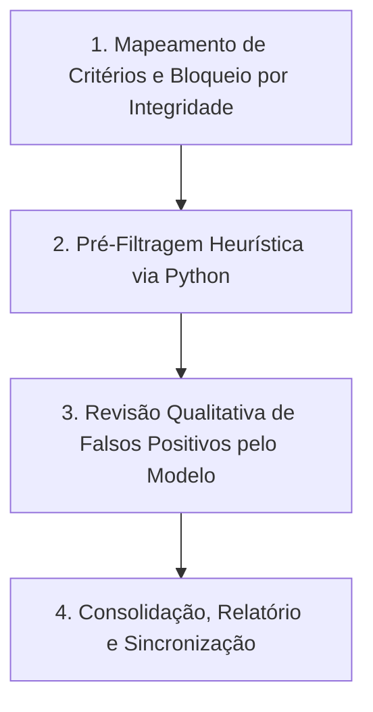

# Skill: Triagem Rápida de Revisão Sistemática (Sem API Externa)

## Visão Geral
Esta skill orienta qualquer modelo atuando no Antigravity a realizar a **Triagem de Título e Resumo (Triagem 1)** em uma base de dados de revisão sistemática (JSON/CSV) com **alta velocidade, precisão e autonomia**, sem dependência de APIs externas de LLM.

---

## 🛑 REGRA DE OURO INEGOCIÁVEL: INTEGRIDADE DE DADOS

> [!CAUTION] **REGRA ABSOLUTA PARA ESTUDOS COM METADADOS INCOMPLETOS**
> **NUNCA realize a triagem (não classifique como Incluído nem como Excluído) se qualquer elemento essencial (como o resumo ou título) estiver ausente, corrompido, incompleto ou deslocado** (ex: `"Não Informado"`, `"Pt"`, `"Apêndice"`, resumo em campo errado ou texto truncado).
> 
> **MESMO QUE O TÍTULO PAREÇA TOTALMENTE ESCLARECEDOR OU ÓBVIO**, se o resumo estiver faltando ou corrompido, **É ESTRITAMENTE PROIBIDO TRIAR**. O estudo **DEVE PERMANECER COMO `Pendente`** para busca manual de informações completas.

---

## Protocolo de Execução em 4 Passos

---

### Passo 1: Mapeamento de Critérios e Bloqueio de Integridade

1. **Mapear a estrutura do arquivo mestre** (`revisao_sistematica2.json` ou similar):
   - **Critérios de Inclusão (CI)**: Foco central em inferência/descoberta causal (CI1) e aplicação a políticas públicas / desenvolvimento regional (CI2).
   - **Critérios de Exclusão (CE)**: Menção incidental/superficial de causalidade (CE1); área de saúde, biologia, direito civil/trabalhista ou mercado financeiro fora de escopo (CE2); tipo de publicação (CE3).

2. **Aplicar Filtro de Bloqueio**:
   - Identificar todos os registros onde o campo `Resumo` ou `Título` seja nulo, vazio, `"Não Informado"`, `"Pt"`, `"Apêndice"`, `"Inclui apendices"`, etc.
   - Marcar/Manter estes estudos **obrigatoriamente como `"Pendente"`**, com observação: `"Pendente: Resumo ausente, incompleto ou deslocado"`.

---

### Passo 2: Pré-Filtragem Heurística via Python (Redução de Escopo)

Para os estudos que **possuem título E resumo válidos e completos**, execute um script Python temporário em `scratch/`:

- **Exclusão Rápida**: Estudos cujos resumos válidos não contêm termos causais ou metodológicos (ex: `"causal"`, `"causalidade"`, `"inferência causal"`, `"granger"`, `"propensity"`, `"diferenças em diferenças"`, `"controle sintético"`, `"qca"`, `"rdd"`) são marcados como `Excluído` (CE1/CE2).
- **Potencialmente Incluídos**: Estudos com resumos completos que possuem os termos-chave são isolados num arquivo auxiliar (ex: `heuristic_review.json`) para análise qualitativa do modelo.

---

### Passo 3: Revisão de Qualidade pelo Modelo Antigravity

O modelo inspeciona os resumos completos do lote isolado em partes (usando `view_file`) e elimina **Falsos Positivos**:

1. **Reclassificar para `Excluído` (CE1 - Menção Incidental)** se:
   - O termo "causalidade" for mencionado apenas filosoficamente, ontologicamente, sociologicamente de forma vaga ou no discurso narrativo.
   - O termo "nexo de causalidade" for utilizado no sentido estritamente jurídico (direito civil, trabalhista, responsabilidade civil).
   - O termo aparecer apenas como limitação ("não foi possível inferir causalidade").

2. **Reclassificar para `Excluído` (CE2 - Fora do Escopo)** se:
   - O estudo for de Saúde Pública / Medicina / Epidemiologia (ex: hipertensão, covid, vacinas, obstetrícia, agrotóxicos, drogas).
   - O estudo for de Biologia / Ecologia / Zoologia.
   - O estudo for de Mercado Financeiro puro (ex: Ibovespa, commodities agrícolas sem foco em política pública).

3. **Manter como `Incluído`** somente se:
   - O resumo demonstrar que o estudo aborda **centralmente** inferência/descoberta causal em políticas públicas de desenvolvimento.

---

### Passo 4: Consolidação, Relatório e Sincronização

1. **Gravar Atualizações**: Escrever as decisões no JSON mestre, garantindo que **todos os estudos com resumos/metadados incompletos continuem marcados como `Pendente`**.
2. **Gerar Relatório Artifact**: Criar/atualizar `triagem_report.md` com:
   - Tabela consolidada (`Incluídos`, `Excluídos`, `Pendentes`, `Total`).
   - Resumo metodológico e justificativas.
   - Lista completa dos estudos `Pendentes` para busca manual de resumo pelo usuário.
3. **Commit no Git**: Executar no terminal:
   `git add -A; git commit -m "Triagem 1 concluída (regra estrita de pendentes)"; git push origin main`

---

## Cuidados e Erros Comuns

- ❌ **VIOLAÇÃO GRAVE DE REGRA:** Tentar triar ou deduzir a decisão de um estudo que não possui resumo completo, mesmo que o título seja totalmente evidente.
- ❌ **Erro de Sintaxe:** Usar `&&` em comandos do PowerShell no Windows. Use sempre `;` para separar comandos.
- ❌ **Erro de Avaliação:** Tratar menção incidental de palavra-chave como inclusão automática.
- 🟢 **Boa Prática:** Manter todos os registros incompletos em um inventário de `Pendentes` no relatório final para a coleta manual posterior.
