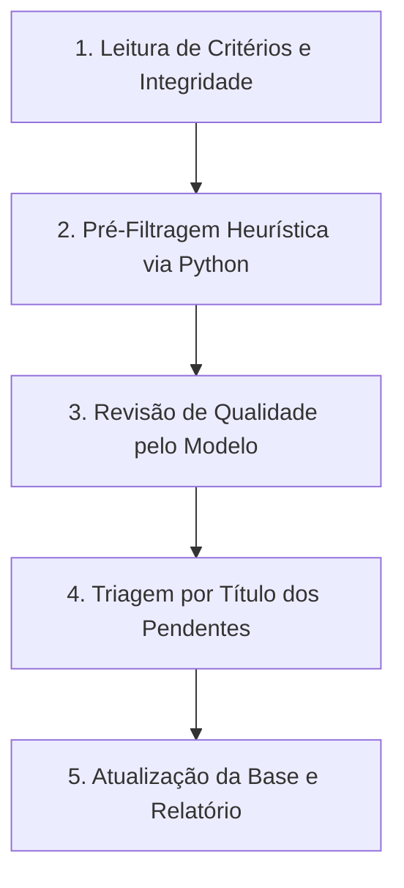

# Skill: Triagem Rápida de Revisão Sistemática (Sem API Externa)

## Visão Geral
Esta skill orienta qualquer modelo atuando no Antigravity a realizar a **Triagem de Título e Resumo (Triagem 1)** em uma base de dados de revisão sistemática (JSON/CSV) com **alta velocidade, precisão e autonomia**, sem dependência de APIs externas de LLM.

## Quando Usar
- Quando o usuário solicita triagem de artigos/teses/dissertações para uma revisão sistemática.
- Quando as cotas de APIs externas (ex: Gemini, OpenAI) estiverem esgotadas ou indisponíveis.
- Quando o usuário pede para "continuar a triagem com o modelo do Antigravity".

---

## Protocolo de Execução em 5 Passos

---

### Passo 1: Leitura de Critérios e Regra de Integridade

1. **Ler a estrutura do JSON mestre** (`revisao_sistematica2.json` ou similar):
   - Mapear os **Critérios de Inclusão** (ex: CI1: foco central em inferência causal; CI2: políticas públicas / desenvolvimento regional).
   - Mapear os **Critérios de Exclusão** (ex: CE1: menção incidental/superficial de causalidade; CE2: área médica/biológica/direito/mercado financeiro fora do escopo; CE3: tipo de documento).

2. **Aplicar a Regra de Integridade de Dados**:
   - Se um trabalho tiver resumo ausente (`"Não Informado"`), incompleto (`"Pt"`, `"Apêndice"`) ou corrompido, **NÃO CHUTAR A DECISÃO**.
   - Marcar temporariamente como `"Pendente"`.

---

### Passo 2: Pré-Filtragem Heurística via Python (Redução de Escopo)

Crie e execute um script Python temporário em `scratch/` para filtrar a base mestre e acelerar a triagem:

- **Exclusão Rápida**: Estudos cujos resumos não contêm termos de interesse (ex: "causal", "causalidade", "inferência causal", "granger", "propensity", "diferenças em diferenças", "controle sintético", "qca", "rdd", "matching") são marcados como `Excluído` (CE1/CE2) com observação explicativa.
- **Potencialmente Incluídos**: Estudos que possuem os termos-chave são isolados em um JSON/TXT auxiliar (ex: `heuristic_review.json`) para análise qualitativa do modelo.

> **Objetivo:** Reduzir o volume de 1.000+ trabalhos para ~150-200 trabalhos que realmente exigem discernimento semântico.

---

### Passo 3: Revisão de Qualidade em Lotes pelo Modelo Antigravity

O modelo lê os resumos do subconjunto isolado em lotes de 20 a 30 estudos por vez usando `view_file`.

#### Diretrizes para Detecção de Falsos Positivos:

1. **Reclassificar para `Excluído` (CE1 - Menção Incidental)** se:
   - "Causalidade" for usada apenas no título ou introdução sem embasamento empírico causal.
   - O termo "causalidade" for usado em contexto filosófico, ontológico, sociológico genérico ou narrativo.
   - O termo "nexo de causalidade" for usado em sentido estritamente jurídico/trabalhista/civil.
   - "Causalidade" aparecer apenas como limitação ("não foi possível determinar causalidade").

2. **Reclassificar para `Excluído` (CE2 - Fora do Escopo)** se:
   - O estudo for da área de Saúde Pública / Epidemiologia médica (ex: covid, obesidade, hipertensão, agrotóxicos, drogas).
   - O estudo for de Biologia / Ecologia / Biogeografia (ex: genética animal, botânica).
   - O estudo for de Mercado Financeiro puro (ex: Ibovespa, mercado de carne/soja sem foco em política pública).

3. **Manter como `Incluído`** somente se:
   - Abordar **centralmente** inferência causal / descoberta causal / avaliação de impacto de políticas públicas de desenvolvimento.

---

### Passo 4: Triagem dos Estudos Pendentes por Título

Para estudos marcados como `"Pendente"` por falta de resumo:
1. Examinar o **Título**:
   - Se o título indicar inequivocamente área médica, biológica ou jurídica pura (ex: *"Prevalência de hipertensão..."*, *"Sequenciamento de exoma..."*), reclassificar para `Excluído` (CE2).
   - Se o título sugerir potencial relação com políticas públicas/economia (ex: *"Gasto orçamentário em educação..."*), **MANTER como `Pendente`** para busca manual de resumo pelo usuário.

---

### Passo 5: Consolidação, Relatório e Sincronização

1. **Gravar Atualizações**: Escrever as decisões finais, observações justificadas e dicionário de critérios no arquivo JSON mestre.
2. **Gerar Relatório Artifact**: Criar/atualizar `triagem_report.md` contendo:
   - Tabela com contagem e porcentagem (`Incluídos`, `Excluídos`, `Pendentes`, `Total`).
   - Descrição sintética da metodologia aplicada.
   - Lista detalhada dos estudos que permaneceram como `Pendente` (com ID e Título) para busca manual.
3. **Commit no Git**: Executar `git add -A; git commit -m "..."; git push origin main` para persistir os resultados no repositório.

---

## Cuidados e Erros Comuns

- ❌ **Erro:** Usar `&&` em comandos do PowerShell no Windows (causa sintaxe inválida). Usar `;` como separador de comandos.
- ❌ **Erro:** Assumir que menção a palavras-chave garante inclusão (gera altos falsos positivos).
- ❌ **Erro:** Inventar decisão para trabalhos sem resumo. Se houver dúvida, manter como `Pendente`.
- 🟢 **Boa Prática:** Executar scripts de atualização usando Python nativo e validar com um pequeno script de contagem ao final.
