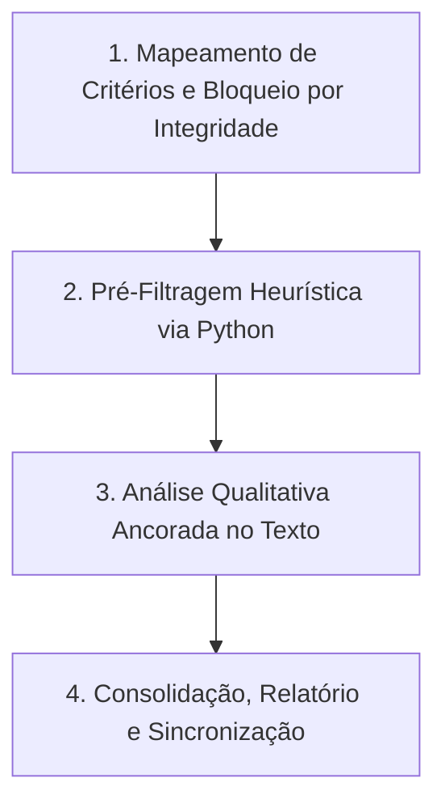

# Skill: Triagem Rápida e Rigorosa de Revisão Sistemática (Ancoragem Estrita no Texto)

## Visão Geral
Esta skill orienta o modelo a realizar a **Triagem de Título e Resumo (Triagem 1)** com a **mesma precisão, clareza, especificidade e alinhamento estrito ao texto** da API do Gemini no aplicativo.

---

## 🛑 DIRETRIZES INEGOCIÁVEIS DE QUALIDADE E EVIDÊNCIA (ZERO ALUCINAÇÃO)

1. **ANCORAGEM ESTRITA NO TEXTO DO RESUMO/TÍTULO**:
   - Responda e classifique baseando-se **ESTRITAMENTE E APENAS** no texto fornecido do título e resumo.
   - **É ESTRITAMENTE PROIBIDO** inferir, presumir, extrapolar ou inventar metodologias, contextos ou achados que não estejam explicitamente declarados no texto.

2. **REGRA ABSOLUTA DE PENDÊNCIA (INTEGRIDADE DE METADADOS)**:
   - Se o campo `Resumo` ou `Título` for nulo, vazio, `"Não Informado"`, `"Pt"`, `"Apêndice"`, ou texto truncado/corrompido, **NÃO TRIAR**. O estudo **DEVE OBRIGATORIAMENTE PERMANECER COMO `Pendente`**.
   - MESMO QUE O TÍTULO PAREÇA ESCLARECEDOR, sem resumo válido a classificação DEVE SER `Pendente`.

3. **JUSTIFICATIVAS ESPECÍFICAS E CITADAS (`observacoes`)**:
   - A justificativa no campo `observacoes` DEVE SER **direta, específica e concisa**, citando trechos ou evidências exatas do texto.
   - Evite afirmações genéricas como *"O estudo é relevante"* ou *"Trata de causalidade"*. Especifique exatamente o motivo:
     - *Exemplo de Exclusão (CE2)*: `"Motivo de Exclusão (CE2): O estudo aborda mercado financeiro puro (Ibovespa) sem foco em políticas públicas."`
     - *Exemplo de Inclusão*: `"Incluído: Aplica Regressão em Descontinuidade (RDD) para avaliar o efeito do Programa Bolsa Família nos municípios do Nordeste."`

4. **COERÊNCIA ENTRE DECISÃO E CRITÉRIOS**:
   - Se a decisão for **Excluído**, é **OBRIGATÓRIO** apontar ao menos 1 critério em `criterios_exclusao` como verdadeiro.
   - Se a decisão for **Incluído**, o trabalho deve atender a TODOS os critérios de inclusão e a NENHUM critério de exclusão.

---

## Protocolo de Execução em 4 Passos

---

### Passo 1: Mapeamento de Critérios e Bloqueio de Integridade

1. **Mapear a estrutura do arquivo mestre** (`revisao_sistematica2.json` ou similar):
   - **Critérios de Inclusão (CI)**: Foco central em inferência/descoberta causal (CI1) e aplicação a políticas públicas / desenvolvimento regional (CI2).
   - **Critérios de Exclusão (CE)**: Menção incidental/superficial de causalidade (CE1); área de saúde, biologia, direito civil/trabalhista ou mercado financeiro fora de escopo (CE2); tipo de publicação (CE3).

2. **Aplicar Filtro de Bloqueio**:
   - Identificar todos os registros onde o campo `Resumo` ou `Título` seja nulo, vazio, `"Não Informado"`, `"Pt"`, `"Apêndice"`, `"Inclui apendices"`, etc.
   - Marcar/Manter estes estudos **obrigatoriamente como `"Pendente"`**, com observação: `"Pendente: Resumo ausente, incompleto ou deslocado"`.

---

### Passo 2: Pré-Filtragem Heurística via Python (Redução de Escopo)

Para os estudos que **possuem título E resumo válidos e completos**, execute um script Python temporário em `scratch/`:

- **Exclusão Rápida**: Estudos cujos resumos válidos não contêm termos causais ou metodológicos (ex: `"causal"`, `"causalidade"`, `"inferência causal"`, `"granger"`, `"propensity"`, `"diferenças em diferenças"`, `"controle sintético"`, `"qca"`, `"rdd"`) são marcados como `Excluído` (CE1/CE2).
- **Potencialmente Incluídos**: Estudos com resumos completos que possuem os termos-chave são isolados num arquivo auxiliar (ex: `heuristic_review.json`) para análise qualitativa ancorada no texto.

---

### Passo 3: Análise Qualitativa Ancorada pelo Modelo Antigravity

O modelo inspeciona os resumos completos do lote isolado em partes (usando `view_file`) e elimina **Falsos Positivos**:

1. **Reclassificar para `Excluído` (CE1 - Menção Incidental)** se:
   - O termo "causalidade" for mencionado apenas filosoficamente, ontologicamente, sociologicamente de forma vaga ou no discurso narrativo.
   - O termo "nexo de causalidade" for utilizado no sentido estritamente jurídico (direito civil, trabalhista, responsabilidade civil).
   - O termo aparecer apenas como limitação ("não foi possível inferir causalidade").

2. **Reclassificar para `Excluído` (CE2 - Fora do Escopo)** se:
   - O estudo for de Saúde Pública / Medicina / Epidemiologia (ex: hipertensão, covid, vacinas, obstetrícia, agrotóxicos, drogas).
   - O estudo for de Biologia / Ecologia / Zoologia.
   - O estudo for de Mercado Financeiro puro (ex: Ibovespa, commodities agrícolas sem foco em política pública).

3. **Manter como `Incluído`** somente se:
   - O resumo demonstrar que o estudo aborda **centralmente** inferência/descoberta causal em políticas públicas de desenvolvimento.

---

### Passo 4: Consolidação, Relatório e Sincronização

1. **Gravar Atualizações**: Escrever as decisões no JSON mestre, garantindo que **todos os estudos com resumos/metadados incompletos continuem marcados como `Pendente`**.
2. **Gerar Relatório Artifact**: Criar/atualizar `triagem_report.md` com:
   - Tabela consolidada (`Incluídos`, `Excluídos`, `Pendentes`, `Total`).
   - Resumo metodológico e justificativas citadas.
   - Lista completa dos estudos `Pendentes` para busca manual de resumo pelo usuário.
3. **Commit no Git**: Executar no terminal se autorizado:
   `git add -A; git commit -m "Triagem 1 concluída (ancoragem estrita em texto)"; git push origin main`
