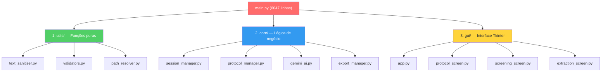
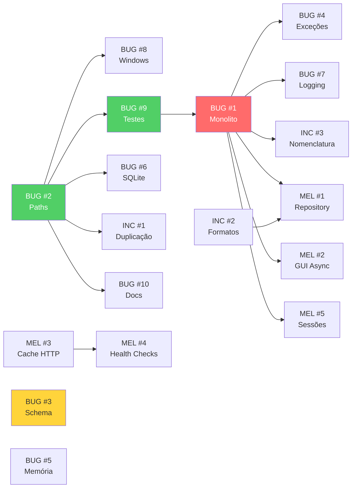

# Planejamento Detalhado de Correções — RSAC

**Baseado em:** [Plano de Correção.md](file:///c:/Users/eduardo.figueira/Downloads/RSAC/Plano%20de%20Corre%C3%A7%C3%A3o.md)  
**Data de Criação:** Agosto 2026  
**Responsável:** Eduardo Figueira  
**Status:** 🟡 Em Planejamento

---

## Índice

1. [Visão Geral e Priorização](#visão-geral-e-priorização)
2. [SPRINT 1 — Estabilização Crítica](#sprint-1--estabilização-crítica)
   - [BUG #2: Hardcoding de Paths Relativos](#bug-2-hardcoding-de-paths-relativos)
   - [BUG #8: Dependência Implícita do Ambiente Windows](#bug-8-dependência-implícita-do-ambiente-windows)
   - [BUG #3: Falta de Validação de Schema nos JSONs](#bug-3-falta-de-validação-de-schema-nos-jsons)
   - [BUG #9: Ausência de Testes Automatizados](#bug-9-ausência-de-testes-automatizados)
3. [SPRINT 2 — Refatoração Estrutural](#sprint-2--refatoração-estrutural)
   - [BUG #1: Monolito no main.py](#bug-1-monolito-no-mainpy)
   - [BUG #4: Tratamento de Exceção Genérico](#bug-4-tratamento-de-exceção-genérico)
   - [BUG #7: Falta de Logging Estruturado](#bug-7-falta-de-logging-estruturado)
   - [INCONSISTÊNCIA #2: Formatos de Saída Heterogêneos](#inconsistência-2-formatos-de-saída-heterogêneos)
4. [SPRINT 3 — Otimização e Resiliência](#sprint-3--otimização-e-resiliência)
   - [BUG #5: Vazamento de Memória em Loops](#bug-5-vazamento-de-memória-em-loops)
   - [BUG #6: Concorrência em Acesso a SQLite](#bug-6-concorrência-em-acesso-a-sqlite)
   - [INCONSISTÊNCIA #1: Duplicação de Harvesters](#inconsistência-1-duplicação-de-harvesters)
   - [INCONSISTÊNCIA #3: Nomenclatura de Variáveis](#inconsistência-3-nomenclatura-de-variáveis)
5. [SPRINT 4 — Melhorias e Modernização](#sprint-4--melhorias-e-modernização)
   - [BUG #10: Documentação Desatualizada](#bug-10-documentação-desatualizada)
   - [MELHORIA #1: Pattern Repository](#melhoria-1-pattern-repository)
   - [MELHORIA #2: Progresso Assíncrono na GUI](#melhoria-2-progresso-assíncrono-na-gui)
   - [MELHORIA #3: Cache de Requisições HTTP](#melhoria-3-cache-de-requisições-http)
   - [MELHORIA #4: Health Checks nas APIs](#melhoria-4-health-checks-nas-apis)
   - [MELHORIA #5: Versionamento de Sessões](#melhoria-5-versionamento-de-sessões)
6. [Matriz de Dependências](#matriz-de-dependências)
7. [Cronograma Consolidado](#cronograma-consolidado)

---

## Visão Geral e Priorização

### Matriz RICE de Priorização

| ID | Item | Reach | Impact | Confidence | Effort | Score RICE | Sprint |
|----|------|:-----:|:------:|:----------:|:------:|:----------:|:------:|
| BUG #2 | Hardcoding de Paths | 10 | 8 | 9 | 3 | **240** | 1 |
| BUG #8 | Dependência Windows | 8 | 7 | 10 | 2 | **280** | 1 |
| BUG #3 | Validação Schema JSON | 7 | 6 | 8 | 4 | **84** | 1 |
| BUG #9 | Ausência de Testes | 10 | 10 | 10 | 8 | **125** | 1 |
| BUG #1 | Monolito main.py | 10 | 10 | 8 | 10 | **80** | 2 |
| BUG #4 | Exceção Genérica | 6 | 5 | 9 | 3 | **90** | 2 |
| BUG #7 | Logging Estruturado | 8 | 5 | 9 | 5 | **72** | 2 |
| INC #2 | Formatos Heterogêneos | 6 | 6 | 7 | 5 | **50** | 2 |
| BUG #5 | Vazamento Memória | 4 | 4 | 7 | 3 | **37** | 3 |
| BUG #6 | Concorrência SQLite | 3 | 4 | 8 | 3 | **32** | 3 |
| INC #1 | Duplicação Harvesters | 5 | 5 | 9 | 4 | **56** | 3 |
| INC #3 | Nomenclatura Variáveis | 4 | 3 | 10 | 6 | **20** | 3 |
| BUG #10 | Documentação | 5 | 3 | 10 | 2 | **75** | 4 |
| MEL #1 | Pattern Repository | 7 | 7 | 6 | 7 | **42** | 4 |
| MEL #2 | GUI Assíncrona | 8 | 8 | 7 | 6 | **75** | 4 |
| MEL #3 | Cache HTTP | 6 | 5 | 8 | 4 | **60** | 4 |
| MEL #4 | Health Checks | 5 | 4 | 9 | 3 | **60** | 4 |
| MEL #5 | Versionamento Sessões | 6 | 5 | 9 | 3 | **90** | 4 |

> [!NOTE]
> **Score RICE** = (Reach × Impact × Confidence) / Effort. Escala de 1-10 para cada dimensão.

### Legenda de Status

| Ícone | Significado |
|:-----:|-------------|
| ⬜ | Não iniciado |
| 🔵 | Em andamento |
| ✅ | Concluído |
| 🔴 | Bloqueado |
| 🟡 | Em revisão |

---

## SPRINT 1 — Estabilização Crítica

**Duração estimada:** 2–3 semanas  
**Objetivo:** Corrigir falhas que comprometem a portabilidade e a confiabilidade imediata do sistema.

---

### BUG #2: Hardcoding de Paths Relativos

| Campo | Detalhe |
|-------|---------|
| **Severidade** | 🔴 Alta |
| **Prioridade** | ALTA |
| **Impacto** | MÉDIO |
| **Estimativa** | 4–6 horas |
| **Dependências** | Nenhuma |
| **Status** | ⬜ Não iniciado |

#### Descrição do Problema

Caminhos relativos fixos como `"openalex_harvester/openalex_metadata.db"` falham em contextos onde:
- O script é executado a partir de diretórios diferentes do raiz do projeto
- A aplicação é empacotada via PyInstaller (`sys._MEIPASS`)
- O usuário move ou renomeia a pasta do projeto

#### Arquivos Afetados

| Arquivo | Linhas Estimadas | Tipo de Alteração |
|---------|:----------------:|:-----------------:|
| `config_app/main.py` | ~100-150, ~300-400 | Refatoração de paths |
| `consolidar_e_deduplicar.py` | ~20-50 | Refatoração de paths |
| `baixar_pdfs.py` | ~30-60 | Refatoração de paths |
| `baixar_sucesso.py` | ~15-40 | Refatoração de paths |
| `baixar_failed_pdfs.py` | ~10-30 | Refatoração de paths |

#### Etapas de Implementação

```
1. [ ] Auditoria — Identificar TODAS as ocorrências de paths hardcoded
   1.1 [ ] Executar grep recursivo: os.path.join, open(", Path(", \.db", \.json", \.xlsx"
   1.2 [ ] Documentar cada ocorrência com arquivo:linha:contexto
   1.3 [ ] Classificar: path absoluto | path relativo | dinâmico (OK)

2. [ ] Criar módulo centralizado de paths
   2.1 [ ] Criar arquivo: config_app/utils/path_resolver.py
   2.2 [ ] Definir BASE_DIR usando Path(__file__).resolve().parent.parent
   2.3 [ ] Implementar detecção PyInstaller (sys._MEIPASS)
   2.4 [ ] Criar constantes nomeadas para cada path recorrente
   2.5 [ ] Implementar função resolve_path(relative_path) → Path

3. [ ] Substituir ocorrências nos arquivos afetados
   3.1 [ ] config_app/main.py — substituir todos os paths hardcoded
   3.2 [ ] consolidar_e_deduplicar.py — idem
   3.3 [ ] baixar_pdfs.py — idem
   3.4 [ ] baixar_sucesso.py — idem
   3.5 [ ] baixar_failed_pdfs.py — idem

4. [ ] Testar
   4.1 [ ] Executar a partir do diretório raiz do projeto
   4.2 [ ] Executar a partir de um diretório diferente (cd .. && python RSAC/config_app/main.py)
   4.3 [ ] Validar que os harvesters encontram seus bancos
   4.4 [ ] Testar em ambiente empacotado (PyInstaller) se disponível
```

#### Código de Referência — `path_resolver.py`

```python
"""
Módulo centralizado para resolução de caminhos do RSAC.
Garante portabilidade entre execução direta e empacotada (PyInstaller).
"""
import sys
from pathlib import Path

def get_base_dir() -> Path:
    """Retorna o diretório raiz do projeto, compatível com PyInstaller."""
    if getattr(sys, 'frozen', False):
        # Executando como executável empacotado
        return Path(sys._MEIPASS)
    return Path(__file__).resolve().parent.parent

BASE_DIR = get_base_dir()

# Diretórios de harvesters
OPENALEX_DIR = BASE_DIR / "openalex_harvester"
SCIELO_DIR = BASE_DIR / "scielo_harvester"
BDTD_DIR = BASE_DIR / "bdtd_harvester"
PUBMED_DIR = BASE_DIR / "pubmed_harvester"
SCOPUS_DIR = BASE_DIR / "scopus_harvester"

# Bancos de dados
DB_PATHS = {
    "OpenAlex": [
        BASE_DIR / "openalex_metadata.db",
        OPENALEX_DIR / "openalex_metadata.db",
    ],
    "SciELO": [
        BASE_DIR / "scielo_metadata.db",
        SCIELO_DIR / "scielo_metadata.db",
    ],
    "BDTD": [
        BASE_DIR / "bdtd_metadata.db",
        BDTD_DIR / "bdtd_metadata.db",
    ],
}

def resolve_db(source_name: str) -> Path | None:
    """Retorna o primeiro caminho existente para o banco da fonte."""
    for candidate in DB_PATHS.get(source_name, []):
        if candidate.exists():
            return candidate
    return None
```

#### Critérios de Aceite

- [ ] Nenhum path hardcoded restante no código (exceto em `path_resolver.py`)
- [ ] Aplicação inicia corretamente a partir de **qualquer diretório de trabalho**
- [ ] Todos os harvesters localizam seus bancos e configs via `path_resolver`
- [ ] Variável `BASE_DIR` é utilizada como âncora única de resolução
- [ ] `grep -rn` por strings de caminho absoluto retorna zero resultados

#### Riscos e Mitigações

| Risco | Probabilidade | Mitigação |
|-------|:------------:|-----------|
| Quebra de imports em harvesters | Média | Testar cada harvester individualmente após mudança |
| Incompatibilidade PyInstaller | Baixa | Manter fallback com `sys._MEIPASS` |
| Caminhos com espaços ou caracteres especiais | Média | Usar `Path` ao invés de `os.path.join` com strings |

---

### BUG #8: Dependência Implícita do Ambiente Windows

| Campo | Detalhe |
|-------|---------|
| **Severidade** | 🟡 Média |
| **Prioridade** | ALTA |
| **Impacto** | MÉDIO |
| **Estimativa** | 2–3 horas |
| **Dependências** | BUG #2 (path_resolver deve existir) |
| **Status** | ⬜ Não iniciado |

#### Descrição do Problema

O código assume ambiente Windows em várias partes:
- Chamada direta a `ctypes.windll.shcore.SetProcessDpiAwareness(1)` sem verificação de SO
- Paths com backslash (`\`) hardcodados
- Uso de `Iniciar_Configurador.bat` como único launcher

#### Arquivos Afetados

| Arquivo | Linhas | Tipo de Alteração |
|---------|:------:|:-----------------:|
| `config_app/main.py` | ~10-17 | Guard condicional por SO |
| `Iniciar_Configurador.bat` | Inteiro | Manter + criar equivalente cross-platform |

#### Etapas de Implementação

```
1. [ ] Identificar todos os pontos Windows-específicos
   1.1 [ ] Buscar por: ctypes.windll, .bat, \\, os.startfile, winsound
   1.2 [ ] Listar cada ocorrência com contexto

2. [ ] Envolver código Windows em guards condicionais
   2.1 [ ] DPI Awareness: if sys.platform == "win32": ...
   2.2 [ ] Envolver cada chamada em try-except para fallback gracioso
   2.3 [ ] Substituir backslashes por Path() ou os.sep

3. [ ] Criar launcher multiplataforma
   3.1 [ ] Manter Iniciar_Configurador.bat (Windows)
   3.2 [ ] Criar iniciar_configurador.sh (Linux/macOS)
   3.3 [ ] Criar __main__.py no pacote config_app para `python -m config_app`

4. [ ] Testar
   4.1 [ ] Verificar que no Windows o DPI awareness funciona normalmente
   4.2 [ ] Verificar que em outros SOs o código não lança exceções
   4.3 [ ] Verificar import do módulo sem erros cross-platform
```

#### Código de Referência — Guard Condicional

```python
# config_app/main.py — Linhas 10-17 (substituição)
import sys

def configure_platform():
    """Configurações específicas de plataforma."""
    if sys.platform == "win32":
        try:
            import ctypes
            ctypes.windll.shcore.SetProcessDpiAwareness(1)
        except (AttributeError, OSError):
            pass  # Silencia em Windows Server ou versões sem shcore
    elif sys.platform == "darwin":
        # macOS: Retina display é gerenciado pelo Tk automaticamente
        pass

configure_platform()
```

#### Critérios de Aceite

- [ ] Zero chamadas diretas a `ctypes.windll` sem `sys.platform` guard
- [ ] Zero backslashes hardcodados em paths (todos via `Path` ou `os.sep`)
- [ ] O módulo `config_app` pode ser importado em qualquer SO sem erro
- [ ] Launcher `__main__.py` funcional

---

### BUG #3: Falta de Validação de Schema nos JSONs

| Campo | Detalhe |
|-------|---------|
| **Severidade** | 🟡 Média |
| **Prioridade** | MÉDIA |
| **Impacto** | MÉDIO |
| **Estimativa** | 6–8 horas |
| **Dependências** | Nenhuma |
| **Status** | ⬜ Não iniciado |

#### Descrição do Problema

Os arquivos JSON de configuração dos harvesters (`bdtd_config.json`, `scielo_config.json`, etc.) são lidos sem validação, causando:
- `KeyError` em runtime por campos obrigatórios ausentes
- Tipos incorretos não detectados (string onde deveria ser int)
- Erros descobertos apenas durante execução da coleta

#### Arquivos Afetados

| Arquivo | Tipo de Alteração |
|---------|:-----------------:|
| `config_app/core/config_schemas.py` | **[NOVO]** — Modelos Pydantic |
| `bdtd_harvester/bdtd_harvester.py` | Adicionar validação na leitura |
| `scielo_harvester/scielo_harvester.py` | Adicionar validação na leitura |
| `openalex_harvester/openalex_harvester.py` | Adicionar validação na leitura |
| `pubmed_harvester/pubmed_harvester.py` | Adicionar validação na leitura |
| `scopus_harvester/scopus_harvester.py` | Adicionar validação na leitura |

#### Etapas de Implementação

```
1. [ ] Análise dos JSONs existentes
   1.1 [ ] Coletar exemplos reais de cada JSON de configuração
   1.2 [ ] Mapear campos obrigatórios vs. opcionais por harvester
   1.3 [ ] Identificar tipos de dados esperados (str, int, float, list)
   1.4 [ ] Documentar valores default razoáveis

2. [ ] Definir modelos Pydantic
   2.1 [ ] Instalar pydantic (adicionar ao requirements.txt)
   2.2 [ ] Criar BaseHarvesterConfig (campos comuns)
   2.3 [ ] Criar modelos específicos: BDTDConfig, ScieloConfig, etc.
   2.4 [ ] Adicionar validators customizados (delay > 0, keywords não vazio)

3. [ ] Implementar função de carregamento validado
   3.1 [ ] Criar load_config(path, model_class) → model
   3.2 [ ] Tratar ValidationError com mensagens claras para o usuário
   3.3 [ ] Implementar merge com defaults para backward compatibility

4. [ ] Integrar nos harvesters
   4.1 [ ] Substituir json.load() direto por load_config() em cada harvester
   4.2 [ ] Garantir que KeyError não ocorra mais em campos ausentes
   4.3 [ ] Adicionar mensagem de erro amigável na GUI quando validação falha

5. [ ] Testar
   5.1 [ ] Testar com JSON completo válido
   5.2 [ ] Testar com campo obrigatório ausente → erro claro
   5.3 [ ] Testar com tipo errado (string onde espera int) → erro claro
   5.4 [ ] Testar com JSON vazio → erro claro
   5.5 [ ] Testar backward compatibility com configs existentes
```

#### Código de Referência — `config_schemas.py`

```python
"""
Modelos de validação para configurações dos harvesters.
Usa Pydantic para garantir integridade antes da execução.
"""
from pydantic import BaseModel, Field, field_validator
from typing import Optional

class BaseHarvesterConfig(BaseModel):
    """Configuração base compartilhada por todos os harvesters."""
    db_path: str = Field(..., min_length=1, description="Caminho do banco SQLite")
    export_path: str = Field(..., min_length=1, description="Caminho de exportação")
    limit: Optional[int] = Field(default=None, ge=1, description="Limite de registros")
    delay: float = Field(default=3.0, gt=0, description="Delay entre requisições (s)")
    keywords: list[str] = Field(..., min_length=1, description="Palavras-chave de busca")
    
    @field_validator('keywords')
    @classmethod
    def keywords_not_empty(cls, v):
        if not v or all(k.strip() == '' for k in v):
            raise ValueError('Pelo menos uma keyword não-vazia é obrigatória')
        return [k.strip() for k in v if k.strip()]

class BDTDConfig(BaseHarvesterConfig):
    """Configuração específica do harvester BDTD."""
    institution_filter: Optional[str] = None
    year_start: Optional[int] = Field(default=None, ge=1900, le=2100)
    year_end: Optional[int] = Field(default=None, ge=1900, le=2100)

class ScieloConfig(BaseHarvesterConfig):
    """Configuração específica do harvester SciELO."""
    collection: str = Field(default="scl", description="Coleção SciELO (ex: scl, col)")
    language_filter: Optional[list[str]] = None

class OpenAlexConfig(BaseHarvesterConfig):
    """Configuração específica do harvester OpenAlex."""
    email: Optional[str] = Field(default=None, description="Email para polite pool")
    filter_type: str = Field(default="works", description="Tipo de entidade")

class PubMedConfig(BaseHarvesterConfig):
    """Configuração específica do harvester PubMed."""
    api_key: Optional[str] = None
    retmax: int = Field(default=100, ge=1, le=10000)

class ScopusConfig(BaseHarvesterConfig):
    """Configuração específica do harvester Scopus."""
    api_key: str = Field(..., min_length=1, description="Chave API Scopus obrigatória")
    insttoken: Optional[str] = None


def load_config(path: str, model_class: type[BaseHarvesterConfig]) -> BaseHarvesterConfig:
    """
    Carrega e valida configuração JSON contra o modelo Pydantic.
    
    Raises:
        FileNotFoundError: Se o arquivo não existe.
        ValidationError: Se o JSON não atende ao schema.
    """
    import json
    from pathlib import Path as P
    
    config_path = P(path)
    if not config_path.exists():
        raise FileNotFoundError(f"Arquivo de configuração não encontrado: {path}")
    
    with open(config_path, 'r', encoding='utf-8') as f:
        raw = json.load(f)
    
    return model_class(**raw)
```

#### Critérios de Aceite

- [ ] Todos os 5 harvesters usam `load_config()` ao invés de `json.load()` direto
- [ ] JSON com campo obrigatório ausente gera mensagem clara (não `KeyError` genérico)
- [ ] JSON com tipo errado gera mensagem indicando o campo e tipo esperado
- [ ] Configurações existentes (legadas) continuam funcionando sem modificação
- [ ] `pydantic` adicionado ao `requirements.txt`

---

### BUG #9: Ausência de Testes Automatizados

| Campo | Detalhe |
|-------|---------|
| **Severidade** | 🔴 Crítica |
| **Prioridade** | CRÍTICA |
| **Impacto** | ALTO |
| **Estimativa** | 12–16 horas |
| **Dependências** | BUG #2 (paths resolvidos para imports corretos) |
| **Status** | ⬜ Não iniciado |

#### Descrição do Problema

O projeto não possui **nenhum** teste automatizado. Cobertura: **0%**. Isso torna qualquer refatoração (especialmente o BUG #1) extremamente arriscada.

#### Estrutura de Testes Proposta

```
tests/
├── __init__.py
├── conftest.py                     # Fixtures compartilhadas
├── unit/
│   ├── __init__.py
│   ├── test_path_resolver.py       # Testa resolução de paths
│   ├── test_config_schemas.py      # Testa validação de configs
│   ├── test_deduplication.py       # Testa normalização e dedup
│   ├── test_text_sanitizer.py      # Testa limpeza de texto
│   └── test_session_manager.py     # Testa load/save sessões
├── integration/
│   ├── __init__.py
│   ├── test_harvester_configs.py   # Testa carga real de configs
│   └── test_consolidation.py       # Testa pipeline completo
└── fixtures/
    ├── sample_config_valid.json
    ├── sample_config_invalid.json
    ├── sample_session.json
    └── sample_records.db
```

#### Etapas de Implementação

```
1. [ ] Configurar infraestrutura de testes
   1.1 [ ] Instalar pytest, pytest-cov, pytest-mock
   1.2 [ ] Criar pytest.ini ou pyproject.toml com config de testes
   1.3 [ ] Criar tests/__init__.py e tests/conftest.py
   1.4 [ ] Criar diretório tests/fixtures/ com dados de teste
   1.5 [ ] Adicionar dependências de teste ao requirements-dev.txt

2. [ ] Implementar testes para funções puras (prioridade máxima)
   2.1 [ ] test_deduplication.py
         - normalize_title(): remoção de acentos, espaços, case
         - clean_doi(): extração de DOI de URLs variadas
         - deduplicate_records(): merging correto de duplicatas
   2.2 [ ] test_path_resolver.py (após BUG #2)
         - get_base_dir(): retorno correto em dev e empacotado
         - resolve_db(): encontra DB existente, retorna None para inexistente
   2.3 [ ] test_config_schemas.py (após BUG #3)
         - Validação com JSON válido
         - Rejeição com campo ausente
         - Rejeição com tipo errado
         - Aplicação de defaults

3. [ ] Implementar testes de integração
   3.1 [ ] test_harvester_configs.py — carga real dos JSONs de config
   3.2 [ ] test_consolidation.py — pipeline end-to-end com dados mock

4. [ ] Configurar cobertura
   4.1 [ ] Adicionar pytest-cov ao pipeline de testes
   4.2 [ ] Gerar relatório HTML de cobertura
   4.3 [ ] Definir threshold mínimo: 30% na Sprint 1, meta 80%

5. [ ] Documentar convenções de teste
   5.1 [ ] Nomenclatura: test_{funcionalidade}_{cenário}_{resultado_esperado}
   5.2 [ ] Fixtures: dados reutilizáveis em conftest.py
   5.3 [ ] Comando padrão: pytest tests/ -v --cov=config_app --cov-report=html
```

#### Código de Referência — `conftest.py`

```python
"""Fixtures compartilhadas para todos os testes."""
import pytest
import tempfile
import json
from pathlib import Path

@pytest.fixture
def temp_dir():
    """Diretório temporário limpo para cada teste."""
    with tempfile.TemporaryDirectory() as d:
        yield Path(d)

@pytest.fixture
def sample_valid_config(temp_dir):
    """JSON de configuração válido para testes."""
    config = {
        "db_path": str(temp_dir / "test.db"),
        "export_path": str(temp_dir / "export"),
        "delay": 3.0,
        "keywords": ["planejamento urbano", "desenvolvimento regional"]
    }
    path = temp_dir / "test_config.json"
    path.write_text(json.dumps(config), encoding='utf-8')
    return path

@pytest.fixture
def sample_invalid_config(temp_dir):
    """JSON de configuração inválido (sem keywords)."""
    config = {
        "db_path": str(temp_dir / "test.db"),
        "export_path": str(temp_dir / "export"),
        "delay": -1.0
    }
    path = temp_dir / "test_config_invalid.json"
    path.write_text(json.dumps(config), encoding='utf-8')
    return path
```

#### Código de Referência — `test_deduplication.py`

```python
"""Testes para o módulo de consolidação e deduplicação."""
import pytest

# Estes imports assumem que as funções foram extraídas para módulos
# Ajustar conforme refatoração do BUG #1
from consolidar_e_deduplicar import normalize_title, clean_doi


class TestNormalizeTitle:
    def test_removes_accents(self):
        assert normalize_title("Planejamento Urbano") == "planejamentourbano"
    
    def test_removes_special_characters(self):
        assert normalize_title("Título: com (parênteses)!") == "titulocomparenteses"
    
    def test_handles_empty_string(self):
        assert normalize_title("") == ""
    
    def test_handles_none(self):
        assert normalize_title(None) is None or normalize_title(None) == ""


class TestCleanDoi:
    def test_extracts_from_full_url(self):
        doi = "https://doi.org/10.1590/S0102-88392020000100001"
        assert clean_doi(doi) == "10.1590/s0102-88392020000100001"
    
    def test_handles_bare_doi(self):
        doi = "10.1590/S0102-88392020000100001"
        assert clean_doi(doi) == "10.1590/s0102-88392020000100001"
    
    def test_handles_none(self):
        assert clean_doi(None) is None or clean_doi(None) == ""
    
    def test_handles_empty_string(self):
        assert clean_doi("") == ""
```

#### Critérios de Aceite

- [ ] `pytest tests/` executa sem erros
- [ ] Mínimo de **15 testes** cobrindo funções puras críticas
- [ ] Cobertura ≥ 30% nos módulos core (`consolidar_e_deduplicar.py`, `path_resolver.py`)
- [ ] `pytest.ini` ou seção em `pyproject.toml` configurada
- [ ] `requirements-dev.txt` criado com dependências de teste

---

## SPRINT 2 — Refatoração Estrutural

**Duração estimada:** 4–6 semanas  
**Objetivo:** Modularizar o monolito, padronizar tratamento de erros e logging.  
**Pré-requisito:** Sprint 1 concluída (testes protegem contra regressões).

---

### BUG #1: Monolito no main.py

| Campo | Detalhe |
|-------|---------|
| **Severidade** | 🔴 Crítica |
| **Prioridade** | CRÍTICA |
| **Impacto** | ALTO |
| **Estimativa** | 30–40 horas |
| **Dependências** | BUG #9 (testes devem existir), BUG #2 (paths centralizados) |
| **Status** | ⬜ Não iniciado |

#### Descrição do Problema

O arquivo `config_app/main.py` contém **6.047 linhas** que misturam:
- Interface GUI (Tkinter frames, widgets, event handlers)
- Lógica de negócio (validação, processamento de dados)
- Integração com APIs (Gemini AI)
- Gestão de sessões (load/save JSON)
- Exportação (Excel, PDF)

#### Estrutura Alvo Pós-Refatoração

```
config_app/
├── __init__.py
├── __main__.py                     # Entry point: python -m config_app
├── main.py                         # Bootstrap (< 200 linhas)
├── gui/
│   ├── __init__.py
│   ├── app.py                      # Classe principal da aplicação Tkinter
│   ├── protocol_screen.py          # Tela de protocolo PRISMA
│   ├── search_config_screen.py     # Tela de configuração de busca
│   ├── screening_screen.py         # Tela de triagem (título/abstract)
│   ├── extraction_screen.py        # Tela de extração de dados
│   ├── results_screen.py           # Tela de resultados/exportação
│   └── widgets/
│       ├── __init__.py
│       ├── styled_button.py        # Botões customizados
│       ├── progress_panel.py       # Painel de progresso
│       └── table_view.py           # Visualização tabular
├── core/
│   ├── __init__.py
│   ├── protocol_manager.py         # Lógica PRISMA e protocolo
│   ├── gemini_ai.py                # Integração API Gemini
│   ├── session_manager.py          # Load/Save sessões JSON
│   ├── export_manager.py           # Exportação Excel/PDF
│   ├── screening_engine.py         # Motor de triagem automatizada
│   └── dedup_engine.py             # Motor de deduplicação
└── utils/
    ├── __init__.py
    ├── path_resolver.py            # (já criado no BUG #2)
    ├── text_sanitizer.py           # Limpeza e normalização de texto
    ├── validators.py               # Validações de entrada
    └── platform_compat.py          # Compatibilidade cross-platform (BUG #8)
```

#### Etapas de Implementação

```
1. [ ] Análise e mapeamento do main.py
   1.1 [ ] Identificar e documentar todas as classes no arquivo
   1.2 [ ] Identificar e documentar todas as funções top-level
   1.3 [ ] Mapear dependências entre componentes (grafo de chamadas)
   1.4 [ ] Identificar variáveis de estado globais compartilhadas
   1.5 [ ] Classificar cada bloco: GUI | Core | Util | IO

2. [ ] Criar estrutura de diretórios
   2.1 [ ] Criar config_app/gui/ com __init__.py
   2.2 [ ] Criar config_app/core/ com __init__.py
   2.3 [ ] Criar config_app/utils/ com __init__.py
   2.4 [ ] Criar config_app/gui/widgets/ com __init__.py

3. [ ] Extrair camada utils/ (menor risco, zero dependência GUI)
   3.1 [ ] Extrair text_sanitizer.py — funções de limpeza de texto
   3.2 [ ] Extrair validators.py — validações de entrada
   3.3 [ ] Mover path_resolver.py (já criado no BUG #2)
   3.4 [ ] Criar platform_compat.py (já criado no BUG #8)
   3.5 [ ] Rodar testes após cada extração

4. [ ] Extrair camada core/ (lógica de negócio)
   4.1 [ ] Extrair session_manager.py — load_session(), save_session()
   4.2 [ ] Extrair protocol_manager.py — validação PRISMA, gestão de fases
   4.3 [ ] Extrair gemini_ai.py — chamadas à API Gemini
   4.4 [ ] Extrair export_manager.py — geração Excel/PDF
   4.5 [ ] Extrair screening_engine.py — lógica de triagem
   4.6 [ ] Rodar testes após cada extração

5. [ ] Extrair camada gui/ (interface)
   5.1 [ ] Extrair app.py — classe raiz da aplicação Tkinter
   5.2 [ ] Extrair protocol_screen.py — widgets e handlers de protocolo
   5.3 [ ] Extrair search_config_screen.py
   5.4 [ ] Extrair screening_screen.py
   5.5 [ ] Extrair extraction_screen.py
   5.6 [ ] Extrair results_screen.py
   5.7 [ ] Rodar testes + teste manual completo após cada tela

6. [ ] Reduzir main.py ao bootstrap
   6.1 [ ] main.py deve ter < 200 linhas
   6.2 [ ] Responsabilidade: imports, configuração, iniciar app
   6.3 [ ] Criar __main__.py para `python -m config_app`

7. [ ] Verificação final
   7.1 [ ] Todos os testes passam
   7.2 [ ] Aplicação funciona identicamente ao monolito original
   7.3 [ ] Nenhuma funcionalidade removida ou alterada
   7.4 [ ] Gerar relatório de cobertura atualizado
```

#### Estratégia de Extração (Bottom-Up)



> [!IMPORTANT]
> **Regra de ouro da extração:** Após mover cada módulo, executar os testes antes de prosseguir. Se algum teste falhar, corrigir antes de continuar. Nunca extrair mais de um módulo sem validação intermediária.

#### Critérios de Aceite

- [ ] `config_app/main.py` reduzido a **< 200 linhas**
- [ ] Zero lógica de negócio no `main.py` — apenas bootstrap
- [ ] Cada módulo tem **< 500 linhas**
- [ ] Cada módulo tem responsabilidade **única e clara**
- [ ] Todos os testes passam (zero regressão)
- [ ] Funcionalidade **100% idêntica** ao monolito original
- [ ] Imports circulares: **zero**

---

### BUG #4: Tratamento de Exceção Genérico

| Campo | Detalhe |
|-------|---------|
| **Severidade** | 🟡 Média |
| **Prioridade** | MÉDIA |
| **Impacto** | MÉDIO |
| **Estimativa** | 4–6 horas |
| **Dependências** | BUG #1 (parcial — mais fácil após modularização) |
| **Status** | ⬜ Não iniciado |

#### Descrição do Problema

Blocos `try-except Exception` genéricos em harvesters mascaram erros reais, dificultam debugging e podem esconder bugs de lógica críticos.

#### Etapas de Implementação

```
1. [ ] Auditoria de try-except
   1.1 [ ] Grep por "except Exception" e "except:" em todos os harvesters
   1.2 [ ] Classificar cada ocorrência:
         - Network error (requests.exceptions.*)
         - Parse error (json.JSONDecodeError, bs4 errors)
         - IO error (FileNotFoundError, PermissionError)
         - Lógica (KeyError, IndexError, ValueError)
   1.3 [ ] Documentar ação atual vs. ação desejada para cada exceção

2. [ ] Criar hierarquia de exceções customizadas
   2.1 [ ] Criar config_app/core/exceptions.py
   2.2 [ ] Definir: HarvesterError, NetworkError, ParseError, ConfigError
   2.3 [ ] Cada exceção deve carregar contexto (source, url, details)

3. [ ] Substituir exceções genéricas por específicas
   3.1 [ ] scielo_harvester.py — separar Timeout, RequestException, ParseError
   3.2 [ ] openalex_harvester.py — idem
   3.3 [ ] bdtd_harvester.py — idem
   3.4 [ ] pubmed_harvester.py — idem
   3.5 [ ] scopus_harvester.py — idem

4. [ ] Implementar retry inteligente por tipo de erro
   4.1 [ ] Timeout/ConnectionError → retry com backoff exponencial
   4.2 [ ] 429 Too Many Requests → retry com delay maior
   4.3 [ ] ParseError → logar e pular (sem retry)
   4.4 [ ] AuthError → abortar com mensagem clara

5. [ ] Testar
   5.1 [ ] Mock de timeout → verificar retry
   5.2 [ ] Mock de erro de parsing → verificar que é logado sem retry
   5.3 [ ] Mock de 429 → verificar backoff
```

#### Código de Referência — `exceptions.py`

```python
"""Exceções customizadas do RSAC."""

class RSACError(Exception):
    """Exceção base do RSAC."""
    pass

class HarvesterError(RSACError):
    """Erro durante coleta de dados."""
    def __init__(self, source: str, message: str, url: str = None):
        self.source = source
        self.url = url
        super().__init__(f"[{source}] {message}" + (f" URL: {url}" if url else ""))

class NetworkError(HarvesterError):
    """Erro de rede durante coleta."""
    pass

class ParseError(HarvesterError):
    """Erro ao parsear resposta de API/HTML."""
    pass

class ConfigError(RSACError):
    """Erro de configuração."""
    pass

class RateLimitError(NetworkError):
    """API retornou 429 Too Many Requests."""
    def __init__(self, source: str, retry_after: int = None):
        self.retry_after = retry_after
        super().__init__(source, f"Rate limit atingido. Retry after: {retry_after}s")
```

#### Critérios de Aceite

- [ ] Zero blocos `except Exception` ou `except:` bare nos harvesters
- [ ] Cada tipo de exceção tem tratamento específico e documentado
- [ ] Erros de rede disparam retry (máximo 3 tentativas)
- [ ] Erros de parsing são logados com contexto e pulados
- [ ] Mensagens de erro exibem informação acionável (URL, campo, etc.)

---

### BUG #7: Falta de Logging Estruturado

| Campo | Detalhe |
|-------|---------|
| **Severidade** | 🟢 Baixa |
| **Prioridade** | BAIXA |
| **Impacto** | BAIXO |
| **Estimativa** | 6–8 horas |
| **Dependências** | BUG #1 (parcial — melhor após modularização) |
| **Status** | ⬜ Não iniciado |

#### Etapas de Implementação

```
1. [ ] Escolher framework de logging
   1.1 [ ] Avaliar: structlog vs. loguru vs. stdlib logging
   1.2 [ ] Decisão recomendada: stdlib logging + JSON formatter
         (sem dependência adicional, suficiente para o escopo)

2. [ ] Configurar logging centralizado
   2.1 [ ] Criar config_app/utils/logging_config.py
   2.2 [ ] Definir formatters: console (legível) + arquivo (JSON)
   2.3 [ ] Definir handlers: StreamHandler + RotatingFileHandler
   2.4 [ ] Definir níveis por módulo (harvesters=INFO, GUI=WARNING)

3. [ ] Substituir print() e logs não-estruturados
   3.1 [ ] Buscar por: print(, logger.warning(f", logger.info(f"
   3.2 [ ] Substituir por chamadas com contexto estruturado
   3.3 [ ] Adicionar request_id para correlação entre eventos

4. [ ] Implementar log rotation
   4.1 [ ] RotatingFileHandler: max 5MB por arquivo, 3 backups
   4.2 [ ] Diretório de logs: BASE_DIR / "logs/"

5. [ ] Testar
   5.1 [ ] Verificar que logs aparecem no console em formato legível
   5.2 [ ] Verificar que arquivo JSON é gerado
   5.3 [ ] Verificar que log rotation funciona
   5.4 [ ] Verificar filtragem por nível
```

#### Critérios de Aceite

- [ ] Zero chamadas `print()` para logging (apenas para output ao usuário na GUI)
- [ ] Logs com contexto estruturado: `source`, `action`, `duration`, `count`
- [ ] Arquivo de log JSON rotacionado em `logs/rsac.log`
- [ ] Console com output legível (não JSON)
- [ ] Cada módulo tem seu próprio logger nomeado: `logging.getLogger(__name__)`

---

### INCONSISTÊNCIA #2: Formatos de Saída Heterogêneos

| Campo | Detalhe |
|-------|---------|
| **Severidade** | 🟡 Média |
| **Prioridade** | MÉDIA |
| **Impacto** | MÉDIO |
| **Estimativa** | 8–12 horas |
| **Dependências** | BUG #1 (parcial — mais fácil após modularização) |
| **Status** | ⬜ Não iniciado |

#### Descrição do Problema

Cada harvester exporta em formatos diferentes:

| Harvester | SQLite | CSV | XLSX | JSON Lines |
|-----------|:------:|:---:|:----:|:----------:|
| BDTD | ✅ | ❌ | ✅ | ❌ |
| SciELO | ✅ | ✅ | ✅ | ❌ |
| OpenAlex | ✅ | ❌ | ❌ | ❌ |
| Scopus | ❌ | ❌ | ✅ | ❌ |
| PubMed | ✅ | ❌ | ❌ | ❌ |

#### Etapas de Implementação

```
1. [ ] Definir formato padrão de saída
   1.1 [ ] Formato primário: SQLite (pesquisa e filtro)
   1.2 [ ] Formato secundário: JSON Lines (portabilidade e streaming)
   1.3 [ ] Excel: manter como opção de exportação manual na GUI

2. [ ] Definir schema unificado para tabela de registros
   2.1 [ ] Campos obrigatórios: id, title, abstract, authors, year, doi, source
   2.2 [ ] Campos opcionais: url, keywords, journal, volume, pages, language
   2.3 [ ] Campos de metadados: harvested_at, harvester_version, raw_response

3. [ ] Criar módulo de exportação padronizado
   3.1 [ ] Criar config_app/core/export_manager.py (ou atualizar existente)
   3.2 [ ] Método: export_sqlite(records, db_path, table_name)
   3.3 [ ] Método: export_jsonl(records, file_path)
   3.4 [ ] Método: export_excel(records, file_path) — sob demanda

4. [ ] Atualizar cada harvester
   4.1 [ ] Todos devem retornar records no schema unificado
   4.2 [ ] Todos devem chamar export_sqlite() + export_jsonl()
   4.3 [ ] Remover exportações CSV e XLSX redundantes dos harvesters

5. [ ] Atualizar consolidar_e_deduplicar.py
   5.1 [ ] Simplificar leitura — todas as fontes vêm de SQLite agora
   5.2 [ ] Remover código de parsing de CSV e XLSX variados

6. [ ] Testar
   6.1 [ ] Cada harvester gera SQLite e JSONL corretamente
   6.2 [ ] Consolidação funciona com novo formato
   6.3 [ ] Backward compatibility: consolidação ainda lê formatos antigos
```

#### Critérios de Aceite

- [ ] Todos os 5 harvesters exportam em **SQLite + JSONL** com schema unificado
- [ ] `consolidar_e_deduplicar.py` simplificado (leitura de formato único)
- [ ] Schema de campos documentado e validado
- [ ] Exportação Excel disponível **apenas** como ação manual na GUI

---

## SPRINT 3 — Otimização e Resiliência

**Duração estimada:** 2–3 semanas  
**Objetivo:** Resolver problemas de performance, concorrência e reduzir duplicação de código.

---

### BUG #5: Vazamento de Memória em Loops

| Campo | Detalhe |
|-------|---------|
| **Severidade** | 🟢 Baixa |
| **Prioridade** | BAIXA |
| **Impacto** | BAIXO |
| **Estimativa** | 3–4 horas |
| **Dependências** | Nenhuma |
| **Status** | ⬜ Não iniciado |

#### Etapas de Implementação

```
1. [ ] Profiling de memória
   1.1 [ ] Instalar tracemalloc ou memory_profiler
   1.2 [ ] Executar coleta de 500+ registros com profiling ativo
   1.3 [ ] Identificar os top-10 pontos de alocação de memória

2. [ ] Implementar garbage collection controlada
   2.1 [ ] Adicionar del de DataFrames intermediários após processamento
   2.2 [ ] Implementar gc.collect() a cada N páginas (50 recomendado)
   2.3 [ ] Converter acumulação em lista para processamento em batch + flush

3. [ ] Considerar streaming para coletas grandes
   3.1 [ ] Para > 500 registros: gravar em SQLite incrementalmente
   3.2 [ ] Não manter todos os registros em memória simultaneamente

4. [ ] Testar
   4.1 [ ] Comparar uso de memória antes/depois em coleta de 500+ registros
   4.2 [ ] Verificar que resultados são idênticos (sem perda de dados)
```

#### Critérios de Aceite

- [ ] Uso de memória em coleta de 1000 registros **< 500MB**
- [ ] DataFrames intermediários são liberados após processamento
- [ ] `gc.collect()` chamado periodicamente em loops longos

---

### BUG #6: Concorrência em Acesso a SQLite

| Campo | Detalhe |
|-------|---------|
| **Severidade** | 🟢 Baixa |
| **Prioridade** | BAIXA |
| **Impacto** | BAIXO |
| **Estimativa** | 3–4 horas |
| **Dependências** | BUG #2 (path_resolver para paths dos bancos) |
| **Status** | ⬜ Não iniciado |

#### Etapas de Implementação

```
1. [ ] Criar context manager centralizado para SQLite
   1.1 [ ] Implementar get_db_connection(db_path, timeout=30)
   1.2 [ ] Configurar PRAGMA journal_mode=WAL
   1.3 [ ] Configurar isolation_level='DEFERRED'

2. [ ] Substituir conexões diretas em todos os módulos
   2.1 [ ] Buscar por: sqlite3.connect(
   2.2 [ ] Substituir por: with get_db_connection(path):
   2.3 [ ] Garantir que conexões são sempre fechadas (sem leak)

3. [ ] Implementar retry em caso de lock
   3.1 [ ] Interceptar OperationalError "database is locked"
   3.2 [ ] Retry com backoff: 1s, 2s, 4s (máximo 3 tentativas)

4. [ ] Testar
   4.1 [ ] Teste com acesso concorrente simulado (2 threads)
   4.2 [ ] Verificar que "database is locked" não ocorre em condições normais
```

#### Critérios de Aceite

- [ ] Todas as conexões SQLite passam pelo context manager centralizado
- [ ] WAL mode ativo em todos os bancos
- [ ] Zero ocorrências de "database is locked" em uso normal
- [ ] Conexões sempre fechadas (sem resource leak)

---

### INCONSISTÊNCIA #1: Duplicação de Harvesters

| Campo | Detalhe |
|-------|---------|
| **Severidade** | 🟡 Média |
| **Prioridade** | MÉDIA |
| **Impacto** | MÉDIO |
| **Estimativa** | 4–6 horas |
| **Dependências** | BUG #2 (paths centralizados) |
| **Status** | ⬜ Não iniciado |

#### Descrição do Problema

Existem duas cópias de cada harvester:
- `/<harvester_name>/<harvester_name>.py` — código executável
- `config_app/<harvester_name>/` — apenas configs JSON

Risco: correções aplicadas em um local mas não no outro.

#### Etapas de Implementação

```
1. [ ] Auditar diferenças entre cópias
   1.1 [ ] diff entre scielo_harvester/ e config_app/scielo_harvester/
   1.2 [ ] Repetir para cada harvester
   1.3 [ ] Documentar divergências encontradas

2. [ ] Definir localização canônica
   2.1 [ ] Harvesters ficam em: /<harvester_name>/ (raiz do projeto)
   2.2 [ ] config_app/<harvester_name>/ contém SOMENTE configs JSON

3. [ ] Atualizar imports no config_app
   3.1 [ ] config_app/main.py importa de /<harvester_name>/ via path correto
   3.2 [ ] Utilizar path_resolver para localizar os harvesters

4. [ ] Remover duplicatas
   4.1 [ ] Remover código .py duplicado de config_app/<harvester_name>/
   4.2 [ ] Manter apenas JSONs de config em config_app/<harvester_name>/

5. [ ] Testar
   5.1 [ ] Verificar que cada harvester é encontrado e executado
   5.2 [ ] Verificar que configs JSON são lidos corretamente
```

#### Critérios de Aceite

- [ ] Cada harvester existe em **exatamente um local** (código .py)
- [ ] Configs JSON em `config_app/<harvester>/` sem código duplicado
- [ ] Imports funcionam corretamente a partir do `config_app`

---

### INCONSISTÊNCIA #3: Nomenclatura de Variáveis

| Campo | Detalhe |
|-------|---------|
| **Severidade** | 🟢 Baixa |
| **Prioridade** | BAIXA |
| **Impacto** | BAIXO |
| **Estimativa** | 6–10 horas |
| **Dependências** | BUG #1 (modularização deve ser concluída primeiro) |
| **Status** | ⬜ Não iniciado |

#### Etapas de Implementação

```
1. [ ] Definir convenções de nomenclatura
   1.1 [ ] Código: inglês (variáveis, funções, classes, módulos)
   1.2 [ ] Comentários: inglês ou português (consistente por arquivo)
   1.3 [ ] Docstrings: português (voltado ao usuário brasileiro)
   1.4 [ ] Nomes de arquivo: snake_case em inglês

2. [ ] Mapear termos para tradução
   2.1 [ ] carregar_dados → load_data
   2.2 [ ] buscar_registros → fetch_records
   2.3 [ ] limpar_texto → sanitize_text
   2.4 [ ] salvar_sessao → save_session
   2.5 [ ] (compilar lista completa com contexto)

3. [ ] Executar renomeação módulo por módulo
   3.1 [ ] Usar IDE rename/refactor para segurança
   3.2 [ ] Rodar testes após cada módulo renomeado
   3.3 [ ] Manter aliases temporários se necessário para compatibilidade

4. [ ] Testar
   4.1 [ ] Todos os testes passam
   4.2 [ ] Aplicação funciona sem erros de NameError
```

> [!WARNING]
> Esta tarefa deve ser realizada **somente após** a conclusão do BUG #1 (modularização). Renomear variáveis em um monolito de 6.000 linhas é muito mais arriscado do que em módulos separados de 200-500 linhas.

#### Critérios de Aceite

- [ ] 100% dos nomes de variáveis, funções e classes em **inglês**
- [ ] Docstrings de funções públicas em português (opcional)
- [ ] Nenhum `NameError` ou `AttributeError` introduzido

---

## SPRINT 4 — Melhorias e Modernização

**Duração estimada:** 4–6 semanas  
**Objetivo:** Adicionar funcionalidades que melhoram UX, resiliência e manutenibilidade.

---

### BUG #10: Documentação Desatualizada

| Campo | Detalhe |
|-------|---------|
| **Severidade** | 🟢 Baixa |
| **Prioridade** | BAIXA |
| **Estimativa** | 2–3 horas |
| **Dependências** | BUG #2 (paths devem estar centralizados antes) |
| **Status** | ⬜ Não iniciado |

#### Etapas de Implementação

```
1. [ ] Auditar documentação existente
   1.1 [ ] README.md — verificar paths, instruções de instalação, exemplos
   1.2 [ ] Procedimento_Uso_Sistema_Revisao.md — verificar referências
   1.3 [ ] Buscar por paths absolutos do desenvolvedor (C:\Users\eduardo...)

2. [ ] Corrigir referências
   2.1 [ ] Substituir paths absolutos por relativos ou variáveis
   2.2 [ ] Atualizar instruções de instalação
   2.3 [ ] Atualizar capturas de tela se houver mudanças visuais

3. [ ] Criar/atualizar documentação técnica
   3.1 [ ] Atualizar README.md com estrutura atual do projeto
   3.2 [ ] Documentar setup do ambiente de desenvolvimento
   3.3 [ ] Documentar como executar testes
   3.4 [ ] Documentar como adicionar um novo harvester
```

#### Critérios de Aceite

- [ ] Zero paths absolutos do desenvolvedor na documentação
- [ ] README.md reflete a estrutura atual (pós-refatoração)
- [ ] Instruções de instalação funcionam em máquina limpa

---

### MELHORIA #1: Pattern Repository

| Campo | Detalhe |
|-------|---------|
| **Estimativa** | 8–10 horas |
| **Dependências** | BUG #1 (modularização), INC #2 (formato padronizado) |
| **Status** | ⬜ Não iniciado |

#### Etapas de Implementação

```
1. [ ] Definir interface abstrata DataRepository
   1.1 [ ] Métodos: save(), load(), count(), filter(), delete()
   1.2 [ ] Usar ABC (Abstract Base Class)

2. [ ] Implementar SQLiteRepository
   2.1 [ ] CRUD completo via context manager (BUG #6)
   2.2 [ ] Suporte a filtros dinâmicos
   2.3 [ ] Suporte a paginação

3. [ ] Implementar JSONLRepository
   3.1 [ ] Streaming read/write
   3.2 [ ] Append-friendly

4. [ ] Migrar harvesters e consolidação para usar Repository
   4.1 [ ] Substituir acesso direto a sqlite3 por SQLiteRepository
   4.2 [ ] Rodar testes

5. [ ] Testar
   5.1 [ ] Testes unitários para cada implementação
   5.2 [ ] Teste de integração: harvester → repository → consolidação
```

---

### MELHORIA #2: Progresso Assíncrono na GUI

| Campo | Detalhe |
|-------|---------|
| **Estimativa** | 8–10 horas |
| **Dependências** | BUG #1 (separação GUI/core) |
| **Status** | ⬜ Não iniciado |

#### Etapas de Implementação

```
1. [ ] Criar worker thread base
   1.1 [ ] Classe HarvestWorker(threading.Thread)
   1.2 [ ] Comunicação via queue.Queue() para progress updates
   1.3 [ ] Suporte a cancelamento via threading.Event()

2. [ ] Implementar progress bar na GUI
   2.1 [ ] Widget ttk.Progressbar configurável
   2.2 [ ] Label com status textual (ex: "Coletando página 3 de 50...")
   2.3 [ ] Botão de cancelamento

3. [ ] Integrar com harvesters
   3.1 [ ] Cada harvester reporta progresso via callback
   3.2 [ ] GUI consome queue a cada 100ms via after()

4. [ ] Testar
   4.1 [ ] GUI não congela durante coleta de 100+ registros
   4.2 [ ] Cancelamento interrompe a coleta corretamente
   4.3 [ ] Progress bar reflete o progresso real
```

---

### MELHORIA #3: Cache de Requisições HTTP

| Campo | Detalhe |
|-------|---------|
| **Estimativa** | 4–6 horas |
| **Dependências** | Nenhuma |
| **Status** | ⬜ Não iniciado |

#### Etapas de Implementação

```
1. [ ] Instalar cachecontrol + lockfile
   1.1 [ ] Adicionar ao requirements.txt

2. [ ] Criar session HTTP centralizada com cache
   2.1 [ ] Criar config_app/utils/http_client.py
   2.2 [ ] CacheControl wrapping requests.Session
   2.3 [ ] Cache file-backed em BASE_DIR / ".http_cache"

3. [ ] Integrar nos harvesters
   3.1 [ ] Substituir requests.get() direto por cached_session.get()
   3.2 [ ] Configurar max-age por base (OpenAlex=1h, SciELO=24h)

4. [ ] Implementar limpeza de cache
   4.1 [ ] Comando na GUI para limpar cache
   4.2 [ ] Auto-limpeza de entradas > 7 dias

5. [ ] Testar
   5.1 [ ] Segunda execução é significativamente mais rápida
   5.2 [ ] Cache é respeitado (sem re-requisição)
   5.3 [ ] Limpeza de cache funciona
```

---

### MELHORIA #4: Health Checks nas APIs

| Campo | Detalhe |
|-------|---------|
| **Estimativa** | 3–4 horas |
| **Dependências** | MELHORIA #3 (HTTP client centralizado) |
| **Status** | ⬜ Não iniciado |

#### Etapas de Implementação

```
1. [ ] Definir endpoints de health check por base
   1.1 [ ] OpenAlex: https://api.openalex.org/works?per-page=1
   1.2 [ ] SciELO: https://search.scielo.org/
   1.3 [ ] BDTD: https://bdtd.ibict.br/
   1.4 [ ] PubMed: https://eutils.ncbi.nlm.nih.gov/entrez/eutils/einfo.fcgi
   1.5 [ ] Scopus: https://api.elsevier.com/health

2. [ ] Implementar check_api_health()
   2.1 [ ] Timeout curto (5s)
   2.2 [ ] Retorno: {name, status, latency_ms, error_message}

3. [ ] Integrar na GUI
   3.1 [ ] Painel de status com indicadores visuais (🟢🟡🔴)
   3.2 [ ] Check automático ao abrir tela de configuração de busca
   3.3 [ ] Check manual sob demanda (botão "Verificar Conexões")

4. [ ] Testar
   4.1 [ ] API online → indicador verde
   4.2 [ ] API offline (mock) → indicador vermelho com mensagem
   4.3 [ ] Timeout → indicador amarelo
```

---

### MELHORIA #5: Versionamento de Sessões

| Campo | Detalhe |
|-------|---------|
| **Estimativa** | 3–4 horas |
| **Dependências** | BUG #1 (session_manager extraído) |
| **Status** | ⬜ Não iniciado |

#### Etapas de Implementação

```
1. [ ] Definir formato versionado
   1.1 [ ] Adicionar campo "session_version" ao JSON de sessão
   1.2 [ ] Adicionar "created_at", "modified_at", "app_version"
   1.3 [ ] Manter backward compatibility (sessões sem versão = "0.9")

2. [ ] Implementar migração automática
   2.1 [ ] Ao carregar sessão antiga, converter para formato novo
   2.2 [ ] Manter backup da sessão original (.bak)
   2.3 [ ] Logar a migração realizada

3. [ ] Implementar detecção de incompatibilidade
   3.1 [ ] Se session_version > app_version → aviso ao usuário
   3.2 [ ] Se session_version << app_version → migração automática

4. [ ] Testar
   4.1 [ ] Carregar sessão legada (sem version) → migra corretamente
   4.2 [ ] Carregar sessão atual → sem mudanças
   4.3 [ ] Salvar sessão → inclui version e timestamps
```

---

## Matriz de Dependências



> [!IMPORTANT]
> **Caminho crítico:** BUG #2 → BUG #9 → BUG #1. Estes três itens devem ser resolvidos nesta ordem. Todos os outros itens dependem direta ou indiretamente de pelo menos um deles.

---

## Cronograma Consolidado

| Semana | Sprint | Itens | Estimativa Total |
|:------:|:------:|-------|:----------------:|
| 1 | Sprint 1 | BUG #2 (Paths) + BUG #8 (Windows) | 6–9h |
| 2 | Sprint 1 | BUG #3 (Schema) + BUG #9 (Testes - início) | 12–16h |
| 3 | Sprint 1 | BUG #9 (Testes - conclusão) + Buffer | 6–8h |
| 4–5 | Sprint 2 | BUG #1 (Monolito - análise + utils/ + core/) | 20–25h |
| 6–7 | Sprint 2 | BUG #1 (Monolito - gui/) + BUG #4 (Exceções) | 15–20h |
| 8–9 | Sprint 2 | BUG #7 (Logging) + INC #2 (Formatos) | 14–20h |
| 10 | Sprint 3 | BUG #5 (Memória) + BUG #6 (SQLite) | 6–8h |
| 11 | Sprint 3 | INC #1 (Duplicação) + INC #3 (Nomenclatura) | 10–16h |
| 12–13 | Sprint 4 | BUG #10 (Docs) + MEL #1 (Repository) | 10–13h |
| 14–15 | Sprint 4 | MEL #2 (GUI Async) + MEL #3 (Cache) | 12–16h |
| 16 | Sprint 4 | MEL #4 (Health) + MEL #5 (Sessões) | 6–8h |

**Estimativa total:** 117–159 horas (~16 semanas, 1 desenvolvedor, ~10h/semana)

---

> [!TIP]
> **Recomendação:** Comece pelo **BUG #2** (Paths) + **BUG #8** (Windows) na primeira semana — são de baixo risco, alto impacto e desbloqueia praticamente todos os outros itens.

---

**Documento gerado em:** Agosto 2026  
**Próxima revisão:** Ao final de cada Sprint  
**Formato:** Marcar itens como `[x]` conforme completados
