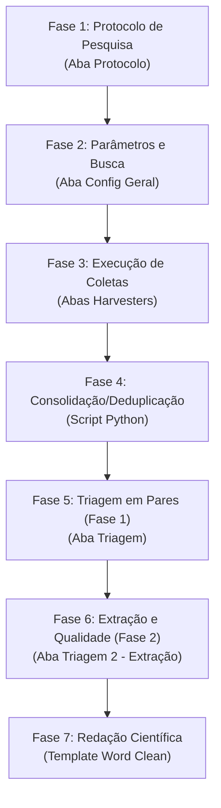

# Procedimento Metodológico de Uso: Sistema de Revisão da Literatura

Este documento estabelece o **procedimento operacional e metodológico** detalhado para a condução de Revisões Sistemáticas de Literatura (RSL) utilizando o ecossistema de software **Sistema de Revisão da Literatura** (localizado em `C:\Users\eduardo.figueira\Documents\Sistema de Revisão da Literatura`). 

A estruturação deste procedimento fundamenta-se nas diretrizes internacionais do **PRISMA 2020** (Page et al., 2022) e nas conclusões e recomendações do artigo de meta-pesquisa **"Revisões Sistemáticas em Desenvolvimento Regional no Brasil: Análise dos Procedimentos Metodológicos (2016-2026)"** (Figueira & Oliveira, 2026). O objetivo principal é guiar o pesquisador na execução de uma revisão robusta, reprodutível e livre de vieses metodológicos comuns identificados na literatura nacional.

---

## 1. Fundamentos Metodológicos e Mitigação de Vieses

A análise metodológica de RSLs na última década revelou falhas recurrentes que este procedimento visa mitigar ativamente por meio do uso correto das funcionalidades do software:

1. **Combate ao Viés de Publicação (Inclusão da Literatura Cinzenta)**: 
   * *O problema:* 0% das revisões sistemáticas analisadas consultaram repositórios de literatura cinzenta (como a BDTD), gerando um viés inflacionado em direção a artigos revisados por pares com resultados positivos.
   * *A solução:* O uso obrigatório do módulo **BDTD Harvester** integrado ao sistema para recuperar teses e dissertações brasileiras.
2. **Triagem em Dupla-Cega por Pares Independentes**:
   * *O problema:* 90% das RSLs analisadas omitiram o número de revisores ou realizaram a seleção por apenas um pesquisador, aumentando a subjetividade e o risco de exclusão arbitrária.
   * *A solução:* Fluxo operacional de exportação/importação de sessões JSON do software para conciliação de decisões entre múltiplos revisores independentes.
3. **Avaliação da Qualidade Metodológica e Risco de Viés**:
   * *O problema:* 70% das RSLs omitiram qualquer avaliação de qualidade ou risco de viés dos estudos incluídos, equiparando evidências metodologicamente frágeis a estudos robustos.
   * *A solução:* Configuração de campos dinâmicos de extração no software contendo escalas qualitativas específicas (ex: escala de pontuação própria, AMSTAR-2 ou índices como o *InOrdinatio*).
4. **Reprodutibilidade e Transparência de Busca**:
   * *O problema:* Omissão de datas de busca, strings exatas e parâmetros de filtros em publicações acadêmicas.
   * *A solução:* O aplicativo gera automaticamente um arquivo de auditoria `1_config_busca.json` e bancos de dados SQLite (`.db`) contendo o histórico inalterado da coleta.

---

## 2. Visão Geral do Pipeline de Trabalho

O processo de revisão sistemática usando o software divide-se em 7 fases sequenciais:



---

## 3. Guia Operacional Passo a Passo

### Fase 1: Elaboração e Registro do Protocolo de Pesquisa (Aba 1)

O protocolo de pesquisa deve preceder qualquer tentativa de busca física. Ele serve como o "contrato de compliance" da RSL.

1. Execute o aplicativo executando o arquivo [Iniciar_Configurador.bat](file:///C:/Users/eduardo.figueira/Documents/Sistema de Revisão da Literatura/Iniciar_Configurador.bat).
2. Vá para a aba **"Protocolo de Pesquisa"**.
3. No painel esquerdo **"Escolha do Protocolo"**, selecione o framework correspondente à sua área científica:
   * **PRISMA-P (Saúde/Geral)**: Foco no detalhamento da estratégia PICO (População, Intervenção, Comparador, Outcomes) e risco de viés. *Recomendado para a maioria das revisões integrativas e sistemáticas.*
   * **Campbell (Sociais)**: Foco em equidade, diversidade, inclusão e literatura cinzenta.
   * **Methodi Ordinatio**: Recomendado para ranqueamento científico com base em fator de impacto e citações.
   * **Scoping Review (PRISMA-ScR)**: Foco no mapeamento de conceitos amplos utilizando a estrutura PCC (População, Conceito, Contexto).
4. Preencha detalhadamente todos os campos do formulário gerado no painel direito. **Importante:**
   * Defina com precisão os **Critérios de Inclusão** e **Exclusão** (um por linha).
   * Especifique as bases de dados que serão consultadas marcando os checkboxes em **"Bases de Dados a Consultar"** (marcar obrigatoriamente *SciELO, BDTD, Scopus, PubMed e OpenAlex*).
5. No painel esquerdo, clique em **"Salvar Protocolo (.json)"** para arquivar o planejamento.
6. Clique em **"Gerar Configuração de Busca e Avançar"**. O aplicativo exportará os parâmetros do protocolo diretamente para a base de dados de busca.

---

### Fase 2: Configuração Geral dos Parâmetros de Busca (Aba 2)

Nesta etapa, estruturam-se os descritores formais de busca.

1. Acesse a aba **"Configuração Geral"**.
2. **Definição de Termos (Keywords)**:
   * Insira strings de busca detalhadas na caixa de texto.
   * *Recomendação Metodológica:* Utilize termos estruturados bilingues (Português e Inglês) e utilize os operadores booleanos `AND` e `OR` para cruzar o tema central da revisão com o contexto empírico/metodológico.
   * Exemplo de termo adicionado: `("desenvolvimento regional" OR "regional development") AND ("revisão sistemática" OR "systematic review")`.
   * Clique em **"Adicionar Termo"**. A lista será populada no painel à direita.
3. **Parâmetros Globais**:
   * **Limite de Resultados por Termo**: Para buscas exaustivas, deixe este campo em branco ou insira um valor alto (ex: `1000`).
   * **Intervalo entre Requisições (segundos)**: Defina um delay educado (mínimo de `3.0` segundos) para evitar o bloqueio de seu endereço IP por excesso de requisições (Erros 429 - *Too Many Requests*).
   * **Diretório de Saída**: Clique em "Selecionar Diretório" e defina a pasta de destino dos arquivos gerados.

---

### Fase 3: Configuração das Bases de Dados e Coleta (Harvesters)

Cada base de dados integrada possui especificidades técnicas que devem ser configuradas nas suas abas correspondentes antes de executar a busca:

#### A. BDTD Harvester (Aba 2)
* *Função:* Varre a literatura cinzenta brasileira de teses e dissertações.
* *Parâmetros:* Defina o nome do banco SQLite (`bdtd_metadata.db`) e a planilha de exportação. Escolha o campo de busca (padrão: `AllFields`) e os filtros Solr desejados (ex: Tipo de Documento: `doctoralThesis` ou `masterThesis`).

#### B. SciELO Harvester (Aba 3)
* *Função:* Varre o repositório de acesso aberto SciELO. Devido a bloqueios automatizados, o script roda uma instância do browser via Playwright.
* *Parâmetros:* Defina o banco (`scielo_metadata.db`) e o arquivo de exportação.

#### C. OpenAlex Harvester (Aba OpenAlex)
* *Função:* Coleta dados do catálogo global aberto OpenAlex.
* *Parâmetros:* Insira seu e-mail institucional no campo `E-mail (Polite Pool)` para entrar na fila prioritária e rápida da API do OpenAlex.

#### D. PubMed Harvester (Aba PubMed)
* *Função:* Acessa a base de dados de saúde e biologia do NCBI.
* *Parâmetros:* Insira uma chave de API do NCBI (opcional, mas aumenta o limite de requisições por segundo).

#### E. Scopus Harvester (Aba Scopus)
* *Função:* Varre a base internacional de alto impacto Scopus da Elsevier.
* *Parâmetros:* **Obrigatório** inserir uma chave de API válida da Elsevier (`API Key`) e selecionar o nível de visualização de metadados (`STANDARD` ou `COMPLETE`).

#### Execução da Coleta
1. No rodapé do aplicativo, certifique-se de que os checkboxes das fontes desejadas estão marcados em **"Executar Busca em"**.
2. Clique no botão de execução para abrir a janela modal de **"Log de Execução em Tempo Real"**.
3. O sistema executará os scripts sequencialmente (`bdtd_harvester.py`, `scielo_harvester.py`, etc.). Acompanhe as mensagens de progresso no console escuro.
4. Ao término, a mensagem `Todas as buscas concluídas com sucesso!` será exibida e o botão se transformará em `Fechar`.

---

### Fase 4: Consolidação e Deduplicação dos Registros

Após a coleta automatizada, os dados brutos estarão espalhados em diferentes bancos SQLite e planilhas XLSX nas pastas dos harvesters. É necessário unificá-los e eliminar registros duplicados.

1. Feche o configurador GUI.
2. Execute o script de consolidação no terminal do PowerShell a partir da raiz do diretório do sistema:
   ```powershell
   python consolidar_e_deduplicar.py
   ```
3. **Mecanismo Interno de Deduplicação**:
   * O script normaliza os títulos (converte para minúsculas, remove pontuações, acentos e espaços extras) e extrai o núcleo limpo dos DOIs.
   * Avalia a qualidade do metadado de cada registro (dando prioridade àquele que possui resumo disponível).
   * Remove registros duplicados exatos por DOI ou por título normalizado.
4. **Arquivos Gerados (Trilha de Compliance)** na pasta `consolidado/`:
   * [registros_unificados.csv](file:///C:/Users/eduardo.figueira/Documents/Sistema de Revisão da Literatura/consolidado/registros_unificados.csv): Lista final desduplicada pronta para a fase de triagem.
   * [duplicatas_removidas.csv](file:///C:/Users/eduardo.figueira/Documents/Sistema de Revisão da Literatura/consolidado/duplicatas_removidas.csv): Relatório contendo as peças removidas e a justificativa (ex: `Duplicate DOI` ou `Duplicate Title`), servindo de auditoria para o fluxo PRISMA.

---

### Fase 5: Triagem em Par/Dupla-Cega de Títulos e Resumos (Aba 4)

Para garantir o compliance acadêmico e mitigar a subjetividade de exclusão (limitação observada em 90% dos estudos de Desenvolvimento Regional), deve ser realizado o seguinte fluxo de triagem em pares:

```
[Revisor 1] roda o App localmente --> Salva "sessao_revisor_1.json"
                                                                \
                                                                 --> [Conciliação de Discordâncias]
                                                                /
[Revisor 2] roda o App localmente --> Salva "sessao_revisor_2.json"
```

#### Execução da Triagem Individual:
1. Abra a aba **"Triagem de Trabalhos"**.
2. Clique em **"Adicionar Planilha (CSV/XLSX)"** e selecione o arquivo consolidado `consolidado/registros_unificados.csv`.
3. Adicione os **Critérios de Inclusão** e **Critérios de Exclusão** que serão exibidos visualmente na lateral para consulta.
4. **Adicionar Perguntas de Triagem (Obrigatório)**:
   * Adicione perguntas objetivas para orientar a exclusão sistemática. Exemplo:
     * *Pergunta 1:* "Trata-se de uma Revisão Sistemática ou Integrativa com método explícito?"
     * *Pergunta 2:* "O estudo possui foco empírico no Brasil ou América Latina?"
5. Clique em **"Iniciar Nova Sessão de Triagem"**.
6. Para cada artigo exibido na tabela superior:
   * Leia o Título e o Resumo no painel inferior.
   * Marque os checkboxes das perguntas de triagem.
   * Escolha a **Decisão**: `Incluído`, `Excluído` ou `Dúvida`.
   * Se for `Excluído`, o sistema exigirá a seleção de uma **Justificativa de Exclusão** (essencial para preencher o fluxograma PRISMA).
   * Clique em **"Confirmar e Próximo"**.
7. Ao finalizar, clique em **"Salvar Sessão de Triagem"** e salve o arquivo com um nome identificador do revisor (ex: `triagem_sessao_revisor1.json`).

#### Conciliação de Dupla-Cega:
* O Revisor 1 e o Revisor 2 devem fazer a triagem de forma independente, sem comunicação prévia sobre os artigos individuais.
* Após ambos concluírem, compare as listas de inclusão. O pesquisador principal (ou um terceiro revisor em consenso) deve carregar as sessões e resolver artigos classificados de forma discordante (ex: Revisor 1 marcou `Incluído` e Revisor 2 marcou `Excluído`), definindo a decisão consensual final e salvando como `triagem2_sessao.json`.

---

### Fase 6: Extração de Dados e Avaliação de Qualidade (Aba 5)

Uma vez definido o corpus de artigos finais incluídos, passa-se para a extração detalhada de variáveis e avaliação de qualidade metodológica.

1. Vá para a aba **"Triagem 2 - Extração"**.
2. **Definição de Campos de Extração (Compliance de Qualidade)**:
   * *Ação Crítica:* Para sanar a lacuna metodológica de 70% de omissão de avaliação de qualidade identificada por Figueira & Oliveira (2026), defina campos específicos no formulário do aplicativo para avaliar o rigor científico dos artigos selecionados.
   * Adicione os seguintes campos dinâmicos:
     * `qualidade_protocolo`: Declarou o uso de protocolo internacional (ex: PRISMA)? (Sim/Não/Parcial)
     * `qualidade_triagem_pares`: Realizou triagem independente por dupla-cega? (Sim/Não/Não Informado)
     * `qualidade_escala_risco`: Aplicou escala de avaliação de risco de viés (ex: AMSTAR-2, escala de pontuação)? (Sim/Não)
     * `qualidade_literatura_cinzenta`: Buscou teses/dissertações/literatura cinzenta? (Sim/Não)
     * `sintese_tipo`: Qual técnica de síntese foi utilizada? (Qualitativa, Bibliométrica, Meta-análise)
3. **Gestão de Downloads de PDFs (Contorno de Barreiras)**:
   * O sistema tentará baixar os PDFs dos trabalhos marcados como `Incluído` usando resolvedores baseados em DSpace, USP, SciELO ou via DOI.
   * **Tratamento de Falhas (Anti-bots e Paywalls)**:
     * *Opção A (Busca Agêntica Secundária):* Se houver falha de download no painel principal, execute o script [baixar_failed_pdfs.py](file:///C:/Users/eduardo.figueira/Documents/Sistema%20de%20Revis%C3%A3o%20da%20Literatura/baixar_failed_pdfs.py) no terminal para varrer as páginas HTML em busca de links de bitstream alternativos.
     * *Opção B (Associação Local Manual):* Baixe o artigo manualmente em seu navegador de preferência. No aplicativo, selecione o artigo correspondente na tabela, clique em **"Associar PDF Local"** e selecione o arquivo baixado. O app copiará o arquivo para a pasta do projeto com a nomenclatura padronizada e extrairá o texto de forma automática.
     * *Opção C (Script de Automação de Downloads):* Com o PDF recém-baixado na pasta padrão de Downloads do seu computador, execute o script [process_manual_pdf.py](file:///C:/Users/eduardo.figueira/Documents/Sistema%20de%20Revis%C3%A3o%20da%20Literatura/process_manual_pdf.py) no terminal passando o ID do trabalho para associá-lo instantaneamente:
       ```powershell
       python process_manual_pdf.py --id <ID_DO_TRABALHO>
       ```
4. **Extração Textual Assistida**:
   * O texto completo do PDF estará visível no painel central.
   * Use a barra de pesquisa **"Buscar termo no PDF"** para localizar palavras-chave (ex: `PRISMA`, `dupla-cega`, `AMSTAR`, `InOrdinatio`). O software realçará os termos encontrados em amarelo e permitirá navegar pelas ocorrências com os botões `Próximo` e `Anterior`.
   * Digite as informações encontradas nas caixas do formulário de extração à direita.
   * Clique em **"Salvar Extração e Próximo"**.
5. **Exportação dos Resultados**:
   * Ao finalizar todas as leituras, clique em **"Exportar Excel de Extração"**.
   * O software gerará a matriz de extração estruturada no formato Excel, pronta para a criação de gráficos de coautoria, tabelas descritivas de perfil de estudos e discussões analíticas.

---

### Fase 7: Redação Científica e Compilação do Artigo

A redação do documento final deve ser pautada na estrutura formal de uma meta-pesquisa. O documento final gerado deve ser limpo e desvinculado de cabeçalhos de eventos específicos para uso geral em submissões.

1. Utilize o arquivo [Template_Artigo_Revisao_Sistematica.docx](file:///C:/Users/eduardo.figueira/Documents/Sistema de Revisão da Literatura/Template_Artigo_Revisao_Sistematica.docx) localizado em seu workspace de literatura como ponto de partida.
2. **Estrutura de Conteúdo Recomendada**:
   * **Introdução**: Contextualização do Desenvolvimento Regional, importância da RSL como síntese metodológica rigorosa e a lacuna de análise de rigor na área.
   * **Metodologia (Compliance PRISMA 2020)**:
     * Declarar a adesão às diretrizes do PRISMA 2020.
     * Detalhar o uso do *Sistema de Revisão da Literatura* como pipeline integrado.
     * Informar as strings de busca detalhadas, o escopo temporal e as bases de dados pesquisadas (incluindo a BDTD).
     * Descrever o processo de triagem independente por dupla-cega e o mecanismo de consenso.
     * Descrever as escalas de qualidade aplicadas aos estudos.
   * **Desenvolvimento**:
     * Fluxograma de Seleção de Estudos (Fluxograma PRISMA extraído das tabelas de auditoria).
     * Apresentação da Tabela Geral de Estudos Incluídos (caracterização).
     * Análise crítica sobre as estratégias de busca, protocolos declarados, triagem em pares e avaliação de qualidade metodológica encontrada na literatura.
   * **Discussão**: Proposição de recomendações práticas para futuros pesquisadores baseadas nos achados (ex: strings bilíngues detalhadas, avaliação rigorosa do risco de viés).
   * **Conclusão**: Síntese das limitações do estudo e principais contribuições científicas.
   * **Referências**: Lista ABNT gerada a partir dos dados do aplicativo.

---

## 4. Auditoria de Compliance e Reprodutibilidade

Para que a sua pesquisa seja considerada de alto rigor científico (100% reprodutível), armazene e publique em conjunto com o seu artigo os seguintes arquivos de dados gerados ao longo do pipeline (por exemplo, em repositórios abertos como *OSF - Open Science Framework* ou *Zenodo*):

| Arquivo de Compliance | Localização | Função |
| :--- | :--- | :--- |
| `1_config_busca.json` | Pasta do projeto selecionada | Comprova todas as strings de busca, datas de execução, bases de dados e filtros lógicos configurados no software. |
| `registros_unificados.csv` | `consolidado/` | O corpus bruto inicial de artigos desduplicados antes de qualquer avaliação de seleção subjetiva. |
| `duplicatas_removidas.csv` | `consolidado/` | Trilha de auditoria das peças duplicadas removidas de forma algorítmica. |
| `triagem2_sessao.json` | Pasta do projeto selecionada | Contém a decisão final consensual de inclusão/exclusão com as respectivas justificativas de exclusão do PRISMA. |
| `Matriz_Extração.xlsx` | Pasta do projeto selecionada | A base de dados estruturada que deu origem às tabelas e gráficos do desenvolvimento do artigo científico. |

---
*Manual desenvolvido em conformidade técnica com o Sistema de Revisão da Literatura e as diretrizes do PRISMA 2020.*
